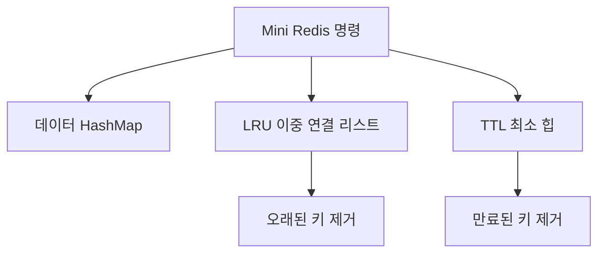
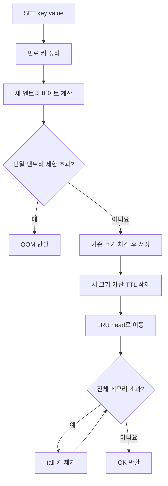

# Mini Redis Basic Knowledge

이 문서는 CLI 기반 Mini Redis 미션을 이해하기 위해 필요한 용어를 초보자 관점에서 정리한 학습 자료입니다. 각 용어는 단순한 정의뿐 아니라 이번 프로젝트에서 어디에 사용되는지도 함께 설명합니다.

## 목차

1. [전체 구조 한눈에 보기](#1-전체-구조-한눈에-보기)
2. [프로그램과 자료구조 기본 용어](#2-프로그램과-자료구조-기본-용어)
3. [배열과 이중 연결 리스트](#3-배열과-이중-연결-리스트)
4. [해시맵과 체이닝](#4-해시맵과-체이닝)
5. [최소 힙과 TTL](#5-최소-힙과-ttl)
6. [LRU와 메모리 제거](#6-lru와-메모리-제거)
7. [메모리 관련 용어](#7-메모리-관련-용어)
8. [시간복잡도](#8-시간복잡도)
9. [CLI와 명령 처리](#9-cli와-명령-처리)
10. [테스트와 안정성](#10-테스트와-안정성)
11. [주요 명령의 내부 흐름](#11-주요-명령의-내부-흐름)
12. [발표용 핵심 답변](#12-발표용-핵심-답변)

---

## 1. 전체 구조 한눈에 보기

Mini Redis는 다음 자료구조를 조합한 인메모리 Key-Value 저장소입니다.

| 자료구조 | 프로젝트에서 하는 일 | 대표 복잡도 |
|---|---|---|
| 해시맵 | 키를 이용해 값을 빠르게 저장·조회·삭제 | 평균 O(1) |
| 체이닝 연결 리스트 | 같은 버킷에 들어온 키들의 해시 충돌 해결 | 버킷 안에서 O(K) |
| 이중 연결 리스트 | 키가 사용된 순서를 기록하여 LRU 관리 | 이동·삭제 O(1) |
| LRU 노드 해시맵 | 키로 연결 리스트 노드를 빠르게 찾음 | 평균 O(1) |
| 최소 힙 | 가장 먼저 만료될 TTL을 빠르게 찾음 | 확인 O(1), 추가·제거 O(log N) |
| 활성 TTL 해시맵 | 현재 유효한 만료 시간인지 확인 | 평균 O(1) |



핵심은 하나의 자료구조로 모든 문제를 해결하지 않는다는 점입니다. 해시맵은 빠른 조회, 이중 연결 리스트는 빠른 순서 변경, 최소 힙은 빠른 최솟값 탐색을 담당합니다.

---

## 2. 프로그램과 자료구조 기본 용어

### 데이터(Data)

프로그램이 저장하거나 처리하는 값입니다. Mini Redis에서는 키와 값이 데이터입니다.

```text
키: user:1
값: Alice
```

### 자료구조(Data Structure)

데이터를 어떤 형태로 저장하고 관리할지 정한 구조입니다. 해시맵, 연결 리스트, 힙 등이 해당합니다.

### 알고리즘(Algorithm)

문제를 해결하기 위해 실행하는 절차입니다. 메모리가 초과되었을 때 가장 오래 사용하지 않은 키부터 제거하는 과정이 알고리즘에 해당합니다.

### Key

저장된 값을 찾을 때 사용하는 이름입니다.

```text
user:1
session:abc
```

### Value

키에 연결된 실제 값입니다.

```text
user:1 → Alice
```

### Key-Value

키와 값의 한 쌍입니다. Redis의 기본 저장 단위입니다.

### 엔트리(Entry)

자료구조에 저장되는 하나의 항목입니다. 해시맵에서는 보통 하나의 Key-Value 쌍을 의미합니다.

### 컬렉션(Collection)

여러 데이터를 모아 관리하는 구조를 통틀어 부르는 말입니다.

### 탐색(Search)

저장된 데이터에서 원하는 항목을 찾는 작업입니다.

### 삽입(Insert)

새 데이터를 자료구조에 추가하는 작업입니다.

### 삭제(Remove/Delete)

기존 데이터를 자료구조에서 제거하는 작업입니다.

### 갱신(Update)

기존 데이터의 값이나 상태를 변경하는 작업입니다. 같은 키에 `SET`을 다시 실행하는 것이 값 갱신에 해당합니다.

### 클래스(Class)

데이터와 기능을 하나로 묶어 정의한 설계도입니다.

```python
class HashMap:
    pass
```

### 객체(Object)·인스턴스(Instance)

클래스를 이용해 실제로 생성한 대상입니다.

```python
data = HashMap()
```

여기서 `data`는 `HashMap` 클래스의 인스턴스입니다.

### 필드(Field)·속성(Attribute)

객체가 내부에 보관하는 값입니다.

```python
self.capacity = 8
self.count = 0
```

### 메서드(Method)

클래스 내부에 정의된 함수입니다.

```python
data.put("name", "Alice")
data.get("name")
```

### 모듈(Module)

관련 코드를 모아놓은 Python 파일입니다.

| 모듈 | 역할 |
|---|---|
| `linked_list.py` | 이중 연결 리스트 |
| `hash_map.py` | 체이닝 해시맵 |
| `min_heap.py` | 최소 힙 |
| `database.py` | Redis 명령, LRU, TTL, 메모리 관리 |
| `cli.py` | 사용자 입력 파싱과 REPL |

### 인터페이스(Interface)

객체의 내부 구현을 모두 몰라도 사용할 수 있도록 외부에 제공하는 기능과 사용 규칙입니다. `HashMap`의 `put`, `get`, `remove` 등이 인터페이스입니다.

---

## 3. 배열과 이중 연결 리스트

### 배열(Array)

데이터를 번호가 있는 칸에 저장하는 구조입니다.

```text
인덱스:  0      1      2      3
값:     A      B      C      D
```

Mini Redis에서는 Python `list`를 해시맵 버킷과 힙의 내부 배열로 제한적으로 사용합니다.

### 인덱스(Index)

배열에서 데이터의 위치를 나타내는 번호입니다. 인덱스를 알고 있으면 해당 위치에 O(1)로 접근할 수 있습니다.

### Capacity

배열에 준비된 전체 칸의 개수입니다. 현재 저장된 데이터 개수와는 다릅니다.

### Size·Count·Length

현재 실제로 저장된 데이터 또는 노드의 개수입니다.

```text
capacity = 8
count = 5
```

위 값은 8칸을 준비했고 데이터 5개가 저장되었다는 뜻입니다.

### 연결 리스트(Linked List)

각 노드가 다른 노드를 가리키도록 연결한 자료구조입니다. 배열처럼 연속된 위치에 저장할 필요가 없습니다.

### 노드(Node)

연결 리스트를 구성하는 하나의 데이터 상자입니다.

```python
class ListNode:
    def __init__(self, data):
        self.prev = None
        self.next = None
        self.data = data
```

| 필드 | 의미 |
|---|---|
| `data` | 노드가 저장하는 실제 데이터 |
| `prev` | 이전 노드에 대한 참조 |
| `next` | 다음 노드에 대한 참조 |

### 참조(Reference)

다른 객체를 가리키는 값입니다. Python에서는 일반적으로 포인터보다 참조라는 표현이 정확합니다.

### 단일 연결 리스트

각 노드가 다음 노드만 가리킵니다.

```text
A → B → C
```

### 이중 연결 리스트(Doubly Linked List)

각 노드가 이전 노드와 다음 노드를 모두 가리킵니다.

```text
A ⇄ B ⇄ C
```

노드의 위치를 이미 알고 있다면 앞뒤 노드의 연결만 변경하여 O(1)에 삭제하거나 이동할 수 있습니다.

### Head

연결 리스트의 첫 번째 노드입니다. LRU 리스트에서는 가장 최근에 사용한 키인 MRU가 위치합니다.

### Tail

연결 리스트의 마지막 노드입니다. LRU 리스트에서는 가장 오래 사용하지 않은 키인 LRU가 위치합니다.

### 주요 리스트 연산

| 메서드 | 동작 | 복잡도 |
|---|---|---|
| `insert_front` | 맨 앞에 노드 추가 | O(1) |
| `insert_back` | 맨 뒤에 노드 추가 | O(1) |
| `remove_front` | 첫 노드 제거 | O(1) |
| `remove_back` | 마지막 노드 제거 | O(1) |
| `remove_node` | 위치를 알고 있는 노드 제거 | O(1) |
| `move_to_front` | 기존 노드를 맨 앞으로 이동 | O(1) |

`remove_node`가 O(1)인 것은 제거할 노드를 이미 알고 있을 때입니다. 데이터 값만 알고 있고 노드를 처음부터 찾아야 한다면 탐색에 O(N)이 필요합니다.

---

## 4. 해시맵과 체이닝

### 해시맵(Hash Map)

키를 이용해 값의 저장 위치를 계산하는 자료구조입니다. 해시가 고르게 분산되면 저장·조회·삭제를 평균 O(1)에 처리합니다.

### 해시 함수(Hash Function)

문자열 같은 키를 정수 해시값으로 변환하는 함수입니다.

```text
"name" → 325287
"age"  → 817244
```

좋은 해시 함수는 비슷한 키도 여러 버킷에 고르게 분산합니다. 이번 구현은 UTF-8 바이트를 대상으로 64비트 FNV-1a 방식을 사용합니다.

### 해시값(Hash Value)

해시 함수가 만든 정수입니다. 값이 매우 클 수 있으므로 그대로 배열 인덱스로 사용하지 않습니다.

### 나머지 연산(Modulo)

나눗셈의 나머지를 구하는 `%` 연산입니다.

```python
index = hash_value % capacity
```

예를 들어 `17 % 8`은 `1`이므로 1번 버킷을 사용합니다.

### 버킷(Bucket)

해시맵 내부 배열의 한 칸입니다. 하나의 버킷에는 충돌한 여러 엔트리가 들어갈 수 있습니다.

### 해시 충돌(Hash Collision)

서로 다른 키가 같은 버킷 인덱스를 가지는 현상입니다.

```text
hash("name") % 8 = 3
hash("city") % 8 = 3
```

충돌은 오류가 아니라 해시맵에서 정상적으로 발생할 수 있는 상황입니다.

### 충돌 해결(Collision Resolution)

같은 버킷에 들어온 서로 다른 키를 구분해 저장하는 방법입니다. 대표적으로 체이닝과 개방 주소법이 있습니다.

### 체이닝(Chaining)

같은 버킷의 엔트리를 연결 리스트로 묶는 충돌 해결 방법입니다.

```text
버킷 3
  ↓
[name:Alice] ⇄ [city:Seoul] ⇄ [team:A]
```

조회할 때 먼저 버킷을 계산한 후 그 버킷의 연결 리스트에서 실제 키가 같은 엔트리를 찾습니다.

### 로드 팩터(Load Factor)

버킷이 얼마나 차 있는지 나타내는 비율입니다.

```text
로드 팩터 = 저장된 엔트리 수 ÷ 버킷 수
```

엔트리 6개와 버킷 8개가 있다면 로드 팩터는 `6 ÷ 8 = 0.75`입니다.

### Resize

로드 팩터가 기준을 초과했을 때 버킷 배열을 더 크게 만드는 작업입니다. 이 프로젝트는 0.75를 초과하면 버킷을 2배로 늘립니다.

### Rehash

버킷 개수가 달라진 후 모든 기존 키의 인덱스를 다시 계산하여 새 배열에 배치하는 과정입니다. 한 번의 rehash는 O(N)이지만 매번 발생하지 않으므로 `put`은 평균적으로 분할 상환 O(1)입니다.

### 평균 O(1)과 최악 O(N)

키가 여러 버킷에 고르게 퍼지면 짧은 체인만 확인하므로 평균 O(1)입니다. 모든 키가 같은 버킷에 몰리면 연결 리스트 전체를 검사해야 하므로 최악 O(N)이 됩니다.

---

## 5. 최소 힙과 TTL

### 트리(Tree)

데이터가 부모와 자식 관계로 연결된 계층형 자료구조입니다.

### 완전 이진 트리(Complete Binary Tree)

위에서 아래로, 왼쪽에서 오른쪽으로 빈자리 없이 채워지는 이진 트리입니다. 힙은 완전 이진 트리이므로 배열로 효율적으로 표현할 수 있습니다.

### 힙(Heap)

가장 작은 값 또는 가장 큰 값을 빠르게 찾기 위한 자료구조입니다. 자료구조의 힙과 프로그램 메모리 영역을 뜻하는 힙 메모리는 서로 다른 개념입니다.

### 최소 힙(Min Heap)

부모 값이 자식 값보다 항상 작거나 같은 힙입니다. 따라서 가장 작은 값이 항상 루트에 있습니다.

```text
       10
      /  \
    20    30
   /  \
 40    50
```

### 루트(Root)

트리의 가장 위에 있는 노드입니다. 최소 힙의 루트에는 전체 항목 중 가장 작은 값이 있습니다.

### 부모·자식 인덱스

배열에서 현재 인덱스가 `i`라면 위치는 다음과 같습니다.

```text
부모:        (i - 1) // 2
왼쪽 자식:   2 * i + 1
오른쪽 자식: 2 * i + 2
```

### `push`

힙에 값을 추가합니다. 배열 끝에 넣고 부모와 비교하며 올바른 위치까지 올립니다. 복잡도는 O(log N)입니다.

### `pop`

루트 값을 제거합니다. 마지막 값을 루트로 옮긴 후 자식과 비교하며 올바른 위치까지 내립니다. 복잡도는 O(log N)입니다.

### `peek`

루트를 삭제하지 않고 확인합니다. 배열의 0번 위치만 읽으므로 O(1)입니다.

### Heapify

힙 규칙이 깨졌을 때 올바른 상태로 복구하는 과정입니다.

| 메서드 | 역할 |
|---|---|
| `_heapify_up` | 새 값을 부모 방향으로 올림 |
| `_heapify_down` | 루트의 값을 자식 방향으로 내림 |

### 튜플(Tuple)

여러 값을 하나로 묶은 데이터입니다. TTL 힙에는 다음 형태로 저장합니다.

```python
(expire_at, key)
```

Python은 튜플을 첫 번째 값부터 비교하므로 만료 시각이 가장 작은 항목이 힙 루트에 위치합니다.

### TTL(Time To Live)

키가 앞으로 살아 있을 시간을 초 단위로 나타낸 값입니다.

```text
EXPIRE session 10
```

위 명령은 `session` 키를 10초 후 만료시킵니다.

### 만료(Expiration)

TTL 시간이 지난 키를 더 이상 존재하지 않는 데이터처럼 처리하는 것입니다.

### `expire_at`

키가 만료되는 절대 시각입니다.

```text
현재 시각: 1000
TTL:       10초
expire_at: 1010
```

### 타임스탬프(Timestamp)

특정 시점을 숫자로 표현한 값입니다. Python의 `time.time()`은 1970년 1월 1일부터 현재까지 흐른 시간을 초 단위로 반환합니다.

### 활성 TTL

현재 키에 실제로 적용되는 최신 만료 정보입니다. `expires` 해시맵에 `key → expire_at` 형태로 저장합니다.

### Stale Entry

더 이상 유효하지 않지만 힙에 남아 있는 과거 만료 기록입니다. 같은 키에 `EXPIRE`를 다시 설정하면 이전 힙 항목이 stale entry가 될 수 있습니다.

### Lazy Deletion

무효가 된 항목을 힙 중간에서 즉시 찾지 않고, 나중에 루트에 도착했을 때 유효성을 검사하여 버리는 방식입니다. 힙 중간을 검색하는 O(N) 작업을 피할 수 있지만, 과거 항목이 한동안 메모리에 남을 수 있습니다.

### 지연 만료

만료 시각이 되는 순간 별도 스레드가 삭제하는 것이 아니라 다음 명령 실행 전에 만료 여부를 확인하고 삭제하는 방식입니다. 이 프로젝트의 `_purge_expired()`가 이 역할을 담당합니다.

### TTL 반환값

| 반환값 | 의미 |
|---|---|
| `N` | 남은 만료 시간 |
| `-1` | 키는 있지만 TTL이 없음 |
| `-2` | 키가 없거나 이미 만료됨 |

---

## 6. LRU와 메모리 제거

### 캐시(Cache)

자주 사용하는 데이터를 빠르게 꺼내기 위해 임시로 보관하는 저장소입니다.

### LRU(Least Recently Used)

가장 오랫동안 사용되지 않은 데이터를 먼저 제거하는 정책입니다.

### MRU(Most Recently Used)

가장 최근에 사용된 데이터입니다.

Mini Redis의 LRU 리스트에서는 다음 위치를 사용합니다.

```text
head = MRU
tail = LRU
```

### LRU 갱신

키가 사용됐다는 사실을 리스트 순서에 반영하는 작업입니다. 성공한 `SET`과 `GET`은 해당 노드를 head로 이동합니다. 만료되거나 존재하지 않는 키의 `GET`은 갱신하지 않습니다.

### LRU 추적

키들의 최근 사용 순서를 계속 기록하는 것입니다. 정확한 사용 시각을 모두 비교하는 대신 연결 리스트의 순서로 표현합니다.

### `lru_nodes`

`key → LRU 리스트 노드`를 저장하는 해시맵입니다. 특정 키의 노드를 평균 O(1)에 찾아 `move_to_front()`를 실행할 수 있게 합니다.

### 왜 해시맵과 이중 연결 리스트를 함께 쓰는가?

| 구조 | 장점 | 단독 사용 시 문제 |
|---|---|---|
| 해시맵 | 키를 평균 O(1)에 찾음 | 사용 순서를 알기 어려움 |
| 이중 연결 리스트 | 순서 이동과 양 끝 삭제 O(1) | 특정 키의 노드를 찾으면 O(N) |
| 두 구조의 조합 | 탐색과 순서 변경 모두 평균 O(1) | 두 구조의 일관성을 함께 관리해야 함 |

### Eviction

메모리 제한을 지키기 위해 기존 데이터를 자동으로 제거하는 작업입니다. `used_memory > maxmemory`이면 LRU 리스트의 tail부터 삭제합니다.

### `evicted_keys`

메모리 부족으로 자동 제거된 키의 누적 개수입니다. 사용자의 `DEL`이나 TTL 만료는 eviction이 아니므로 포함하지 않습니다.

---

## 7. 메모리 관련 용어

### 인메모리(In-Memory)

데이터를 주로 디스크가 아닌 RAM에 저장하는 방식입니다. 빠르지만 공간이 제한적이며 프로그램이 종료되면 데이터가 사라질 수 있습니다.

### RAM

프로그램 실행 중 데이터와 명령을 빠르게 읽고 쓰는 주기억장치입니다.

### 영속성(Persistence)

프로그램을 종료해도 데이터를 파일이나 데이터베이스에 남기는 성질입니다. 이 Mini Redis는 영속성을 구현하지 않습니다.

### `maxmemory`

저장소가 사용할 수 있는 최대 메모리 제한입니다. `0`은 무제한을 의미합니다.

### `used_memory`

과제 기준으로 현재 데이터가 사용하는 메모리 합계입니다.

```text
used_memory = Σ(UTF-8 key 바이트 수 + UTF-8 value 바이트 수)
```

### 바이트(Byte)

컴퓨터에서 데이터 크기를 나타내는 기본 단위입니다.

### UTF-8

문자를 바이트로 표현하는 문자 인코딩 방식입니다. 문자 수와 바이트 수는 다를 수 있습니다.

```python
len("A")                  # 1글자
len("A".encode("utf-8"))  # 1바이트

len("한")                  # 1글자
len("한".encode("utf-8"))  # 3바이트
```

### 오버헤드(Overhead)

실제 키와 값 외에 자료구조를 유지하기 위해 필요한 추가 비용입니다. 노드, 참조, 버킷, Python 객체 정보 등이 해당합니다. 과제 공식의 `used_memory`에서는 오버헤드를 제외합니다.

### OOM(Out Of Memory)

메모리가 부족하여 새로운 데이터를 저장할 수 없는 상태입니다. 단일 Key-Value 엔트리 자체가 `maxmemory`보다 크면 다른 키를 제거해도 저장할 수 없으므로 저장 전 OOM을 반환합니다.

### 덮어쓰기(Overwrite)

이미 존재하는 키에 새로운 값을 저장하는 것입니다. 기존 값의 크기를 `used_memory`에서 빼고 새 값의 크기를 더하며, 기존 TTL은 삭제합니다.

---

## 8. 시간복잡도

### 시간복잡도(Time Complexity)

입력 크기 N이 증가할 때 연산량이 얼마나 증가하는지 나타내는 표현입니다. 실제 실행 시간을 초 단위로 나타내는 것은 아닙니다.

### N

처리 대상 데이터 개수입니다. 상황에 따라 전체 키 수, 버킷 안 엔트리 수, TTL 항목 수 등을 의미합니다.

### O(1)

데이터가 늘어나도 작업량이 거의 일정합니다.

예: 힙의 루트 확인, 알고 있는 연결 리스트 노드 이동, 해시맵의 평균 조회.

O(1)은 반드시 명령 한 번만 실행하거나 1초가 걸린다는 뜻이 아닙니다.

### O(log N)

데이터가 늘어날 때 작업량이 천천히 증가합니다.

예: 최소 힙의 `push`, `pop`.

### O(N)

데이터 개수에 비례해 작업량이 증가합니다.

예: `KEYS`로 전체 키 조회, 모든 데이터 rehash, 한 버킷의 긴 체인 탐색.

### 평균 시간복잡도

일반적인 입력 분포에서 기대할 수 있는 복잡도입니다. 해시맵 조회는 평균 O(1)입니다.

### 최악 시간복잡도

가장 나쁜 입력 상태에서 발생할 수 있는 복잡도입니다. 모든 키가 한 버킷에 충돌하면 해시맵 조회도 최악 O(N)입니다.

### 분할 상환 복잡도(Amortized Complexity)

가끔 비싼 작업이 발생하더라도 여러 연산 전체에 비용을 나누어 계산하는 방식입니다. 해시맵은 resize 때 O(N)이 들지만 자주 발생하지 않으므로 `put`을 분할 상환 O(1)로 볼 수 있습니다.

### 공간복잡도(Space Complexity)

입력 크기 증가에 따라 추가 메모리가 얼마나 필요한지 나타냅니다. Lazy deletion을 사용하면 활성 TTL보다 힙 항목이 더 많이 남을 수 있습니다.

---

## 9. CLI와 명령 처리

### CLI(Command Line Interface)

텍스트 명령으로 프로그램을 사용하는 인터페이스입니다.

```text
mini-redis> SET name Alice
```

### REPL(Read-Evaluate-Print Loop)

다음 과정을 반복하는 실행 환경입니다.

1. Read: 사용자 입력 읽기
2. Evaluate: 명령 분석 및 실행
3. Print: 결과 출력
4. Loop: 다음 입력 기다리기

### 프롬프트(Prompt)

프로그램이 사용자 입력을 기다리고 있음을 나타내는 표시입니다.

```text
mini-redis>
```

### 파싱(Parsing)

사용자 입력 문자열을 명령어와 인자로 나누는 작업입니다.

```text
입력: SET name "Alice Kim"
결과: [SET, name, Alice Kim]
```

### 토큰(Token)

파싱으로 나뉜 각각의 단위입니다.

### 인자(Argument)

명령 실행에 필요한 추가 값입니다. `SET key value`에는 `key`와 `value`라는 두 인자가 필요합니다.

### 명령어 검증

명령 존재 여부, 인자 개수, 정수 입력, 지원 옵션 등을 검사하는 과정입니다.

### Redis 스타일 출력

| 출력 | 의미 |
|---|---|
| `OK` | 명령 성공 |
| `(nil)` | 값이 없음 |
| `(integer) N` | 정수 결과 |
| `(error) ERR ...` | 명령 또는 입력 오류 |
| `(error) OOM ...` | 메모리 초과 오류 |

---

## 10. 테스트와 안정성

### 단위 테스트(Unit Test)

하나의 자료구조나 기능을 독립적으로 검사하는 테스트입니다. 예를 들어 힙에 값을 넣었을 때 작은 순서로 나오는지 확인합니다.

### 통합 테스트(Integration Test)

여러 구조가 함께 동작하는 흐름을 검사합니다.

```text
SET → GET → LRU 갱신 → 메모리 초과 → LRU 제거
```

### 엣지 케이스(Edge Case)

일반적인 상황이 아닌 경계 조건입니다.

- 빈 저장소에서 GET
- TTL이 0인 경우
- 기존 키 덮어쓰기
- 한글 키와 값
- 같은 키에 EXPIRE 반복 설정
- 단일 엔트리가 maxmemory보다 큰 경우

### 불변식(Invariant)

프로그램 실행 중 항상 지켜져야 하는 규칙입니다.

- `used_memory`는 현재 데이터 바이트 합과 같아야 합니다.
- 데이터가 있는 키마다 LRU 노드가 정확히 하나 있어야 합니다.
- `lru_nodes`는 실제 리스트 노드를 가리켜야 합니다.
- LRU의 head는 MRU, tail은 LRU여야 합니다.
- 최소 힙의 부모는 자식보다 작거나 같아야 합니다.

### 일관성(Consistency)

여러 자료구조의 정보가 서로 맞는 상태입니다. 키 하나를 삭제할 때 `data`뿐 아니라 LRU, 활성 TTL, `used_memory`도 함께 갱신해야 합니다.

### Lazy Deletion과 물리적 삭제

DEL을 실행하면 활성 TTL 해시맵에서는 즉시 삭제됩니다. 힙에 남은 과거 TTL은 논리적으로 무효이며, 이후 힙 루트에 도착하면 물리적으로 제거됩니다.

---

## 11. 주요 명령의 내부 흐름

### SET



### GET

1. 최소 힙을 확인해 만료 키를 먼저 삭제합니다.
2. 키가 없으면 `(nil)`을 반환합니다.
3. 값이 있으면 LRU 노드를 head로 이동합니다.
4. 값을 큰따옴표로 감싸 반환합니다.

만료된 키는 삭제 후 없는 키로 처리되므로 LRU를 갱신하지 않습니다.

### DEL

1. 데이터 해시맵에서 Key-Value를 삭제합니다.
2. 해당 바이트를 `used_memory`에서 뺍니다.
3. `lru_nodes`에서 노드를 찾아 LRU 리스트에서 삭제합니다.
4. 활성 TTL을 삭제합니다.
5. 성공하면 `(integer) 1`, 없으면 `(integer) 0`을 반환합니다.

### EXPIRE와 TTL

`EXPIRE`는 `expire_at = 현재 시각 + seconds`를 계산하여 활성 TTL 해시맵과 최소 힙에 저장합니다. `TTL`은 현재 활성 만료 시각에서 현재 시각을 빼 남은 시간을 반환합니다.

### Eviction

1. `used_memory > maxmemory`인지 검사합니다.
2. LRU 리스트의 tail 키를 선택합니다.
3. 데이터·LRU·활성 TTL에서 함께 삭제합니다.
4. `used_memory`를 줄이고 `evicted_keys`를 증가시킵니다.
5. 제한 이하가 될 때까지 반복합니다.

---

## 12. 발표용 핵심 답변

### 해시맵과 체이닝

> 해시 함수는 문자열 키를 정수 해시값으로 바꾸고, 해시값을 버킷 수로 나눈 나머지로 저장 위치를 정합니다. 서로 다른 키가 같은 버킷을 받을 수 있는데 이를 해시 충돌이라고 합니다. 이 구현은 같은 버킷의 엔트리를 이중 연결 리스트로 연결하는 체이닝으로 충돌을 해결합니다. 로드 팩터가 0.75를 넘으면 버킷을 두 배로 확장하고 모든 키를 rehash합니다.

### O(1) LRU 추적

> 이중 연결 리스트는 사용 순서 변경과 tail 삭제를 O(1)에 처리하지만 특정 키의 노드를 찾으면 O(N)이 필요합니다. 그래서 key에서 리스트 노드로 연결되는 해시맵을 함께 사용합니다. 해시맵으로 노드를 평균 O(1)에 찾고 리스트에서 O(1)에 이동하므로 전체 LRU 갱신도 평균 O(1)입니다.

### 힙과 TTL

> TTL 관리에서 중요한 작업은 가장 먼저 만료될 키를 찾는 것입니다. 최소 힙의 루트에는 항상 가장 작은 만료 시각이 있어 O(1)에 확인할 수 있고, TTL 추가와 제거는 O(log N)입니다. EXPIRE 재설정으로 남은 과거 항목은 활성 TTL 해시맵과 비교하여 무시하는 lazy deletion을 사용합니다.

### 메모리 초과와 LRU 제거

> SET할 때 기존 엔트리 크기를 빼고 새 엔트리의 UTF-8 바이트 크기를 used_memory에 더합니다. 새 키를 MRU로 이동한 뒤 used_memory가 maxmemory를 초과하면 리스트의 tail에 있는 LRU 키부터 삭제합니다. 삭제할 때 key와 value의 바이트 크기를 used_memory에서 빼고 evicted_keys를 증가시키며 제한 이하가 될 때까지 반복합니다. 단일 엔트리 자체가 제한보다 크면 기존 데이터를 변경하지 않고 OOM을 반환합니다.

---

## 마지막 한 문장 정리

> Mini Redis는 해시맵으로 데이터를 빠르게 찾고, 이중 연결 리스트로 최근 사용 순서를 관리하며, 최소 힙으로 가장 빠른 만료 시간을 찾아서 조회·LRU 제거·TTL 관리를 효율적으로 처리합니다.
