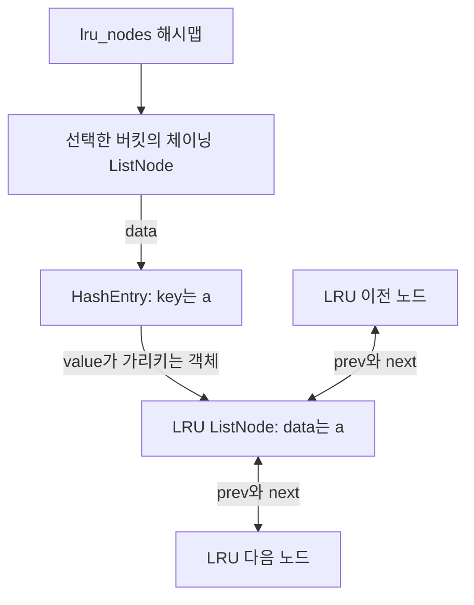
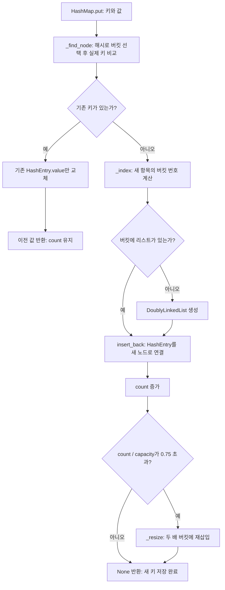
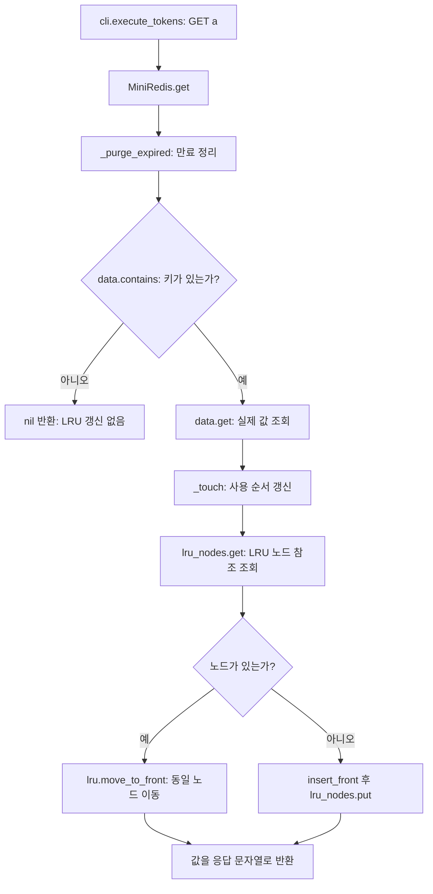
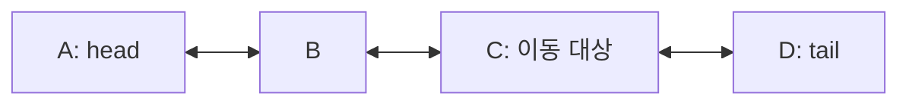
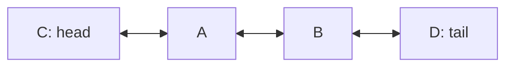
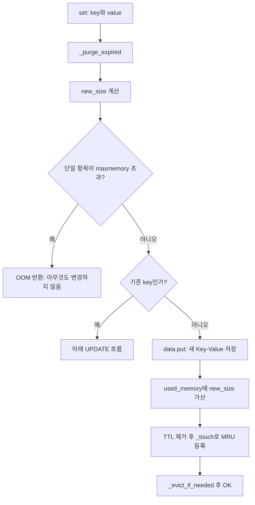
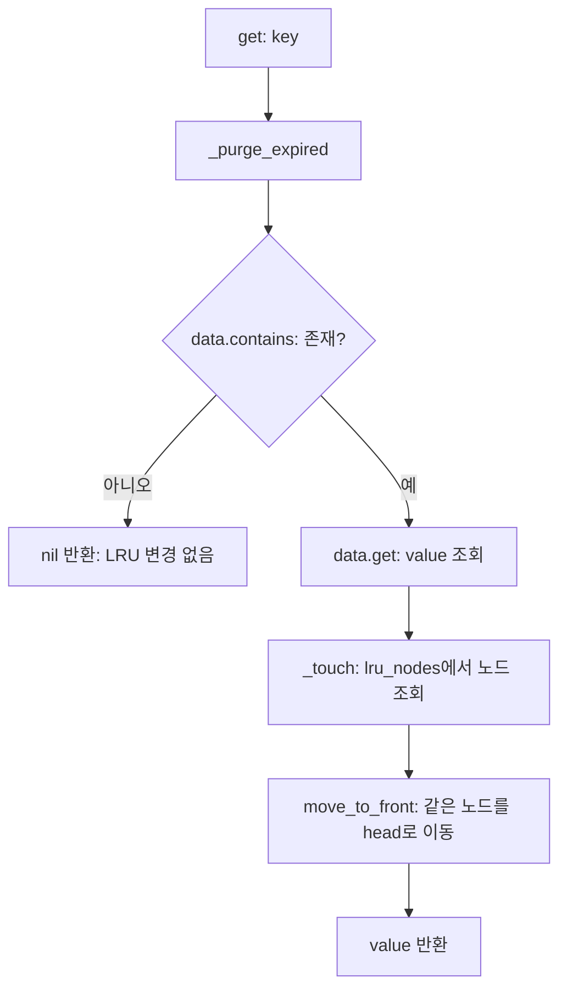
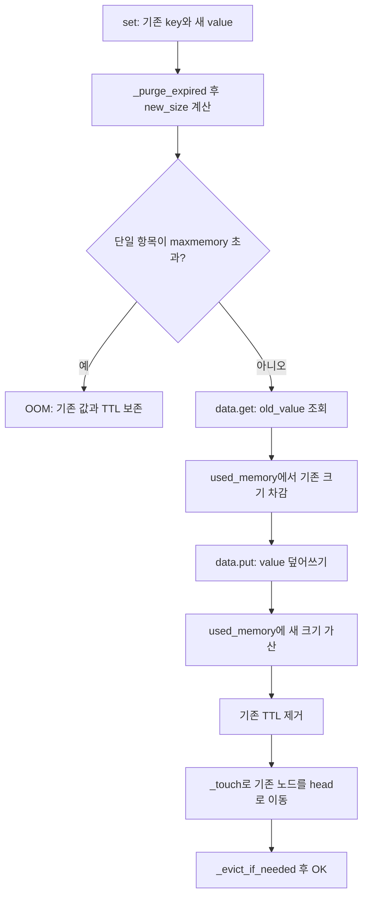
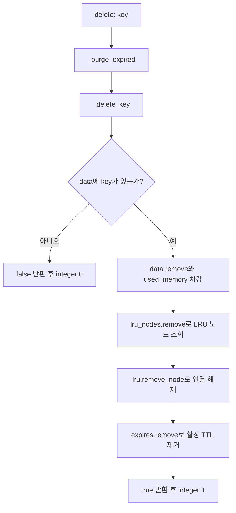

# Mini Redis — 파일별 한 줄 코드 리뷰와 자료구조 흐름

## 읽는 방법과 범위

이 문서는 실제 `mini_redis_project.zip`에 들어 있는 코드를 기준으로 작성했습니다. 시니어 개발자의 리뷰 관점과 초보자에게 설명하는 강의 관점을 함께 사용하되, **원본 코드는 수정하지 않았습니다.** 각 줄을 단순 번역하는 데서 그치지 않고 무엇을 바꾸는지, 왜 필요한지, 어떤 전제가 있는지 설명합니다.

- 제외: `main.py`, 모든 `__init__.py`.
- 포함: 실행 모듈 5개와 테스트 모듈 2개, **총 7개 파일·817줄**.
- 아래 L번호는 문서의 줄 번호가 아니라 **각 원본 Python 파일의 줄 번호**입니다.
- 요청에 따라 **빈 소스 줄 143개는 줄별 리뷰 표에서 제외**했습니다. 나머지 **674개 비어 있지 않은 줄**은 원본 줄 번호를 유지해 설명합니다.
- 코드 표의 원문 데이터에는 선행 공백을 보존했습니다. 다만 뷰어에 따라 공백 표시가 달라질 수 있습니다. 읽기용 표이므로 코드를 실행하려면 원본 `.py` 파일을 사용하세요.
- 줄별 표에서 `**중요:**`가 붙은 설명은 **자료구조의 불변식, 시간복잡도 또는 여러 상태의 일관성에 직접 영향을 주는 핵심 코드**입니다.
- 그림은 Mermaid입니다. Mermaid를 지원하는 Markdown 뷰어에서 그림으로 표시됩니다.
- 테스트 파일의 `if __name__ == "__main__":`는 그 파일의 일부이므로 설명합니다. `main.py` 파일 자체를 리뷰하는 것은 아닙니다.

### 파일별 역할과 읽는 순서

| 순서 | 파일 | 줄 수 | 책임 |
|---:|---|---:|---|
| 1 | [mini_redis/linked_list.py](#review-linked-list) | 98 | 노드, 양방향 연결, 삽입·삭제·이동 |
| 2 | [mini_redis/hash_map.py](#review-hash-map) | 123 | FNV-1a 해시, 버킷, 체이닝, 재해싱 |
| 3 | [mini_redis/min_heap.py](#review-min-heap) | 61 | 배열 기반 최소 힙 |
| 4 | [mini_redis/database.py](#review-database) | 183 | 자료구조를 조합한 SET·GET·LRU·TTL·메모리 관리 |
| 5 | [mini_redis/cli.py](#review-cli) | 71 | 명령 파싱, 인자 검증, 입력·출력 반복 |
| 6 | [tests/test_structures.py](#review-test-structures) | 110 | 개별 자료구조의 불변식과 연산 검사 |
| 7 | [tests/test_database.py](#review-test-database) | 171 | 명령 동작과 여러 자료구조의 일관성 검사 |

**작성 순서와 실행 순서는 다릅니다.** 학습할 때는 작은 자료구조부터 구현하지만, 사용자가 GET을 입력하면 CLI에서 시작해 database를 거쳐 자료구조를 호출합니다.

## A. 코드를 읽기 전에 알아둘 문법

| 문법·표현 | 이 프로젝트에서의 의미 |
|---|---|
| `class` | 데이터와 메서드를 묶은 객체의 설계도 |
| `self` | 현재 메서드를 실행하는 객체 |
| `__init__` 메서드 | 객체를 만들 때 초기 상태를 설정. 제외한 `__init__.py` 파일과는 다른 개념 |
| `_touch`, `_hash` | 내부용 메서드라는 이름 관례. 접근 금지 장치는 아님 |
| `None` | 노드·버킷·값 등이 없음을 나타내는 특별한 값 |
| `is` | 같은 객체를 가리키는지 비교. 노드 참조 비교에 중요 |
| `==` | 값이 같은지 비교. 실제 문자열 키 비교에 사용 |
| `node.next = other` | other 객체의 참조를 연결. 노드 전체를 복사하거나 배열을 이동시키지 않음 |
| `return` | 현재 함수 실행을 끝내고 결과를 호출자에게 전달 |
| `break` / `continue` | 반복 종료 / 다음 반복으로 이동 |
| `a ^= b` | `a = a ^ b`. 비트 XOR 결과로 갱신 |
| `& 0xFFFFFFFFFFFFFFFF` | 하위 64비트만 남기는 AND 마스크 |
| `(i - 1) // 2` | 0부터 시작하는 힙 배열에서 부모 인덱스 계산 |
| `@staticmethod` | 인스턴스 상태 없이 키·값만 받아 크기를 계산하는 함수에 사용 |

## B. 해시맵과 이중 연결 리스트를 만드는 순서

### B-1. 구현 순서

| 단계 | 먼저 작성할 것 | 완성한 뒤 확인할 것 |
|---:|---|---|
| 1 | `ListNode(data)`와 `prev`, `next` | 노드가 이웃 참조와 데이터를 가진다 |
| 2 | `DoublyLinkedList`의 `head`, `tail`, `length` | 빈 리스트에서 양 끝이 None, 길이는 0 |
| 3 | `insert_front`, `insert_back` | 빈 리스트·한 노드·여러 노드 모두 양방향 연결이 맞다 |
| 4 | `remove_node`와 양 끝 삭제 | 중간·처음·끝·마지막 하나 삭제 후에도 연결이 맞다 |
| 5 | `move_to_front` | 동일한 노드를 옮기고 길이는 바꾸지 않는다 |
| 6 | `HashEntry(key, value)`와 버킷 배열 | 연결 구조와 키-값 내용을 분리한다 |
| 7 | `_hash`와 `_index` | 문자열 키를 현재 버킷 범위 안의 번호로 바꾼다 |
| 8 | `_find_node` | 선택한 버킷의 연결 리스트에서 실제 키를 비교한다 |
| 9 | `get`, `contains`, `put`, `remove` | 같은 키 덮어쓰기와 다른 키의 충돌을 구분한다 |
| 10 | `_resize` | 버킷 수가 바뀌면 기존 키를 새 위치로 재배치한다 |
| 11 | `MiniRedis._touch`와 `_delete_key` | 값 저장, LRU 순서, 노드 위치, 메모리 계산이 함께 맞는다 |
| 12 | TTL·메모리 제한·CLI와 테스트 | 작은 연산을 조합한 전체 명령의 순서가 맞는다 |

각 단계마다 작은 테스트를 붙여 확인하세요. 모든 자료구조를 한꺼번에 작성한 뒤 CLI만 실행하면 어느 구조에서 틀렸는지 찾기 어렵습니다.

### B-2. 가장 중요한 구분: 두 종류의 연결 리스트

| 구분 | 해시 버킷의 체이닝 리스트 | LRU 순서 리스트 |
|---|---|---|
| 생성 위치 | `HashMap.put()`의 L59 | `MiniRedis.__init__()`의 L21 |
| 목적 | 같은 버킷에 들어온 서로 다른 키 보관 | 최근 사용 순서 보관 |
| 노드의 `data` | `HashEntry(key, value)` | 키 문자열 |
| 새 항목 삽입 | `insert_back()` | `insert_front()` |
| GET할 때 사용 순서 이동 | 하지 않음 | `_touch()`가 `move_to_front()` 호출 |
| 리스트 개수 | 사용 중인 버킷마다 하나 | MiniRedis 인스턴스마다 하나 |

두 리스트는 **같은 클래스를 재사용하지만 서로 다른 객체**입니다. 또한 `data`, `lru_nodes`, `expires`라는 세 해시맵은 각각 자기 버킷 배열과 자기 체이닝 리스트들을 가집니다.

### B-3. `lru_nodes`가 가리키는 것은 무엇인가?



`HashMap._find_node()`는 **버킷 안의 체이닝 노드**를 반환합니다. `HashMap.get()`은 그 노드의 `data.value`를 반환합니다. `lru_nodes.get(key)`에서는 그 값이 **별도의 LRU 노드**입니다. 같은 `ListNode` 클래스가 여러 곳에 등장한다고 같은 노드인 것은 아닙니다.

| 코드 표현 | 실제로 가리키는 것 |
|---|---|
| `current` in `HashMap._find_node()` | 버킷 안의 체이닝 노드 |
| `current.data` | 키와 값을 담은 HashEntry |
| `current.data.key` | 원래 문자열 키 |
| `current.data.value` | 문자열 값, LRU 노드 참조 또는 만료 시각 |
| `self.lru_nodes.get(key)` | LRU 리스트 안에 있는 바로 그 노드 |
| `self.lru.tail.data` | 가장 오래 사용하지 않은 키 문자열 |

### B-4. 해시맵 `put()`의 호출 흐름



코드로 확인한 실제 충돌 예시는 초기 버킷 수 8에서 `user:0`과 `user:8`이 모두 **0번 버킷**에 들어가는 경우입니다. 이는 같은 키가 아니라 서로 다른 키의 버킷 충돌입니다. 저장 시 두 항목을 연결하고, 조회 시 `current.data.key`로 구분합니다.

### B-5. GET에서 LRU까지 이어지는 흐름



정상 상태에서 GET으로 찾은 키의 LRU 노드는 이미 존재해야 합니다. `_touch()`의 새 노드 생성 분기는 주로 신규 SET에서 사용됩니다. GET을 한 번 실행할 때 `data.contains`, `data.get`, `lru_nodes.get` 등 서로 다른 해시 탐색이 실행되지만, 정상 분포에서 각각이 평균 O(1)이므로 기존 노드 순서 갱신도 평균 O(1)입니다.

### B-6. C 노드를 맨 앞으로 옮길 때

이동 전에는 다음과 같이 연결되어 있다고 가정합니다. 양방향 화살표는 실제 코드의 `next`와 `prev`를 함께 나타냅니다.



| 순서 | 실제 코드의 동작 | 이 예시의 변화 |
|---:|---|---|
| 1 | `node.prev.next = node.next` | B.next를 D로 변경 |
| 2 | `node.next.prev = node.prev` | D.prev를 B로 변경 |
| 3 | `node.prev = None` | C가 맨 앞에 갈 준비 |
| 4 | `node.next = self.head` | C.next를 기존 head A로 변경 |
| 5 | `self.head.prev = node` | A.prev를 C로 변경 |
| 6 | `self.head = node` | head가 C를 가리키도록 변경 |

이동 후에는 다음 연결이 됩니다.



노드의 개수나 객체 자체는 바뀌지 않습니다. 따라서 `length`도, `lru_nodes`가 저장한 C 노드의 참조도 바뀔 필요가 없습니다. 노드가 7만 개여도 이 연결 수정의 수는 일정합니다. 다만 해시맵에서 그 노드를 찾는 비용은 충돌 상태에 영향을 받습니다.

### B-7. SET·GET·UPDATE·DELETE 코드 흐름

**이 코드에 독립적인 UPDATE 명령이나 `update()` 메서드는 없습니다. `SET`이 이미 존재하는 키를 만나면 UPDATE 흐름으로 동작합니다.** 아래 그림은 CLI의 인자 검사 이후 `MiniRedis` 안에서 실행되는 핵심 순서를 나타냅니다.

#### SET: 새 키 저장



**핵심:** 새 값을 먼저 저장한 뒤 전체 사용량이 한도를 넘으면 LRU tail부터 제거합니다. 단, **새 항목 하나만으로 한도를 넘으면 저장 전에 OOM을 반환**합니다.

#### GET: 조회하고 최근 사용으로 갱신



**핵심:** 해시맵이 LRU 노드의 주소를 평균 O(1)에 찾고, 이중 연결 리스트가 이미 찾은 노드의 `prev`·`next`만 바꾸므로 **LRU 갱신은 평균 O(1)**입니다. 한 버킷에 충돌이 몰리면 노드 조회는 O(K), 최악 O(N)이 될 수 있습니다.

#### UPDATE: 기존 키에 SET 실행



**핵심:** 메모리는 `기존 항목 크기 차감 → 새 항목 크기 가산` 순서로 갱신하며, 성공한 덮어쓰기는 기존 TTL을 초기화합니다. OOM 검사가 먼저이므로 실패한 덮어쓰기는 기존 데이터를 손상시키지 않습니다.

#### DELETE: 관련 상태를 함께 삭제



**핵심:** `data`만 지우면 존재하지 않는 키의 LRU 노드와 TTL이 남습니다. 그래서 `_delete_key()`가 **데이터·메모리·LRU·활성 TTL을 하나의 공통 경로에서 함께 갱신**합니다. 최소 힙의 과거 TTL 기록은 남을 수 있지만 나중에 활성 TTL과 비교해 무시하는 lazy deletion을 사용합니다.

## C. 전체 자료구조의 불변식

불변식은 **외부 명령 처리가 정상 종료된 상태에서 계속 참이어야 하는 규칙**입니다. 한 함수 내부에서 여러 연결을 순서대로 갱신하는 도중까지 모든 규칙이 동시에 성립해야 한다는 뜻은 아닙니다.

1. `data`의 각 키는 LRU 리스트에 정확히 한 번 있어야 합니다.
2. `lru_nodes.get(key)`는 그 키를 담은 실제 LRU 노드와 같은 객체여야 합니다.
3. 노드가 있으면 `head.prev is None`, `tail.next is None`이어야 합니다.
4. 양방향 연결이 서로 맞아야 합니다. A.next가 B라면 B.prev는 A입니다.
5. `used_memory`는 저장된 모든 키·값의 UTF-8 바이트 수 합계여야 합니다.
6. `expires`는 현재 유효한 TTL만 나타내며, 해당 키는 실제 데이터에도 있어야 합니다.
7. `expire_heap`에는 과거 기록이 남을 수 있습니다. 힙 항목 수와 활성 TTL 개수가 같을 필요는 없습니다.
8. 양의 메모리 한도가 설정되었다면 정상 명령 종료 후 사용량은 한도 이하여야 합니다.

`_delete_key()`가 데이터·메모리·LRU·활성 TTL 삭제를 한곳에 모은 이유는 이 규칙을 여러 명령에서 동일하게 유지하기 위해서입니다.

## D. 실제 실행으로 확인한 LRU·메모리 흐름

한도는 6바이트입니다. a→11, b→22, c→33은 각각 키 1바이트 + 값 2바이트 = 3바이트입니다.

| 실행한 명령 | LRU 리스트: 최근 → 오래전 | used_memory | evicted_keys |
|---|---|---:|---:|
| `CONFIG SET maxmemory 6` | 빈 리스트 | 0 | 0 |
| `SET a 11` | a | 3 | 0 |
| `SET b 22` | b, a | 6 | 0 |
| `GET a` | a, b | 6 | 0 |
| `SET c 33` | c, a | 6 | 1 |

마지막 SET 내부에서는 새 항목을 넣어 잠깐 9바이트가 된 뒤, tail인 b를 지워 6바이트로 돌아갑니다. 이 값들은 원본 클래스를 호출해 얻은 실제 결과입니다.

## E. 코드 리뷰 결과: 잘한 점과 주의할 점

### 잘한 점

- 리스트, 해시맵, 힙을 독립적으로 구현해 책임이 명확합니다.
- `HashEntry`와 `ListNode`를 분리해 내용과 연결을 구분했습니다.
- `_touch`, `_delete_key`, `_purge_expired`를 공통 경로로 두어 관련 상태의 갱신을 모았습니다.
- 가짜 시계를 주입할 수 있어 TTL 테스트가 빠르고 재현 가능합니다.
- 반환값뿐 아니라 양방향 연결과 메모리 합계를 검사하는 테스트가 있습니다.
- 단일 항목 OOM 검사를 덮어쓰기 전에 하여 아직 만료되지 않은 기존 값과 TTL을 보존합니다.

### 한계와 개선 방향

아래는 **현재 코드의 동작·성능 한계에 대한 리뷰**이며, 수정 완료를 의미하지 않습니다. 모든 지적이 현재 정상 사용에서 발생하는 기능 오류라는 뜻도 아닙니다.

| 구분 | 위치 | 관찰과 영향 | 개선 방향 |
|---|---|---|---|
| 재현한 성능 한계 | `hash_map.py` L108~123 | 재해싱에서 put을 재사용해 중복 키 탐색을 반복. 충돌이 집중되면 전체 O(N²) | 중복이 없다는 전제로 새 버킷에 바로 연결하는 내부 재배치 경로를 분리 |
| 재현한 공간 한계 | `database.py` L170~172 | TTL을 반복 재설정하면 과거 힙 항목이 누적 | 힙 항목 수와 활성 TTL 수의 비율 등을 기준으로 재구축. 지연 시간·메모리의 교환관계도 검토 |
| 메모리 모델의 범위 | `database.py` L26, L33 | used_memory는 키·값 바이트만 계산. 버킷·노드·과거 힙 기록과 임시 객체는 제외 | 미션에서는 이 정의를 명시. 실제 메모리 상한이 필요하면 별도 측정·회계·할당 실패 정책 설계 |
| 평균과 최악 구분 | `hash_map.py` L39~48 | 모든 키가 한 버킷에 모이면 조회 O(N). 부하율만으로 버킷별 편중을 탐지하지 못함 | 충돌 길이 관찰, 해시 전략·충돌 정책 검토. 0.75가 최악 O(1)을 보장한다고 설명하지 않기 |
| 불필요한 탐색 | `database.py` L45~48, L91~95, L105~107 | contains 후 get/remove/put이 같은 키를 다시 탐색 | 찾은 결과 재사용 또는 명확한 missing sentinel API 검토. 읽기 쉬운 현재 코드와 비교해 선택 |
| 순회 복잡도 | `hash_map.py` L94~103 | KEYS는 버킷 수 C와 항목 수 N을 모두 순회. 자동 축소가 없어 삭제 후 C만 클 수 있음 | 정확히 O(C+N)으로 설명. 축소 정책이 필요한지 사용 패턴에 따라 판단 |
| 호출 계약 | `linked_list.py` L58~95 | 다른 리스트의 노드 또는 이미 제거한 노드를 넘기는 것을 검증하지 않음 | 내부 전용 계약을 문서화하거나, 공개 API라면 owner 등 O(1) 소속 검증 방식 검토 |
| 시계와 만료 처리 | `database.py` L29, L59~70 | 시스템 시각 변경의 영향을 받고 명령 실행 때만 만료 정리 | 학습판 동작을 명시. 경과 시간만 필요하면 단조 시계 검토, 유휴 중 정리가 필요하면 별도 작업 설계 |
| 출력과 저장소의 결합 | `database.py` L109, L114 등 | 저장소가 이미 문자열 응답을 만들어 돌려줌. 값의 특수문자도 정식 프로토콜처럼 인코딩하지 않음 | 다른 UI·네트워크 API로 확장할 때는 원시 결과와 출력 포맷터를 분리 |
| 테스트 범위 | `test_database.py` L144~149 | 공백 포함 값을 이미 토큰으로 전달하므로 원시 따옴표 파싱 자체를 검사하지 않음 | run_repl 또는 파싱 함수를 대상으로 별도 테스트. 이번 리뷰의 추가 진단에서는 실제 REPL 경로도 확인 |
| 자료구조 테스트 범위 | `test_structures.py` | 극단 충돌 재해싱, 명시적인 덮어쓰기, 더 큰 힙 경로 등을 충분히 직접 검사하지 않음 | 기존 테스트 클래스에 경계 사례를 추가. 현재 테스트 통과가 모든 상황의 증명은 아님 |

**별도 확인:** 제공된 프로젝트에는 BST 구현 파일이 없습니다. 이 문서는 존재하는 7개 파일을 전부 리뷰한 것입니다. 미션 원문에서 BST 구현을 필수로 요구한다면 그 요구사항 충족 여부는 따로 확인해야 합니다.

### 복잡도를 말할 때의 기준

- N: 해당 해시맵의 키 수, C: 버킷 수, K: 선택한 버킷의 키 수, H: 과거 기록을 포함한 힙 항목 수.
- 문자열 키의 해시 계산은 키 바이트 길이 L에 대해 O(L)입니다. 흔히 말하는 해시맵 평균 O(1)은 키 길이·비교 비용을 일정하게 보고, 적절한 분산과 부하율을 가정합니다.
- 버킷 탐색은 키 비교 횟수 기준 O(K)입니다. 모든 키가 충돌하면 K=N입니다.
- 기존 LRU 노드의 연결 변경은 O(1), 해시맵을 통한 노드 찾기는 평균 O(1)입니다.
- 새 키 등록에서 해시맵이 확장되거나 파이썬 배열의 용량이 늘어나는 개별 호출까지 항상 O(1)은 아닙니다.
- 힙의 위·아래 복구와 pop은 비교 비용을 일정하게 보면 O(log H), peek는 O(1)입니다. push의 배열 append 비용은 상각 기준으로 함께 봅니다.
- 만료 항목 여러 개를 처리하는 GET이나 여러 키를 제거하는 SET의 전체 비용은 그 처리량도 포함합니다.

## F. 검증 결과

### 기존 테스트

원본 프로젝트 루트에서 실행했습니다.

```bash
PYTHONDONTWRITEBYTECODE=1 python3 -m unittest discover -s tests -v
```

**15개 테스트 모두 통과**했습니다. 자료구조 테스트 5개, 저장소·명령 테스트 10개입니다. 실행 로그의 테스트 본문 경과 시간은 0.004초였으며, 이 수치는 성능 벤치마크가 아닙니다.

### 추가 진단: 극단 충돌 재해싱

진단용 하위 클래스에서 `_hash()`만 항상 0을 반환하게 하여 충돌을 강제로 만들었습니다. 원본 HashMap의 put·탐색·재해싱 코드는 그대로 실행했습니다. 키 비교 연산 횟수를 측정했으며 원본 파일은 수정하지 않았습니다.

| 키 수 N | 재해싱 중 키 비교 횟수 |
|---:|---:|
| 32 | 496 |
| 64 | 2,016 |
| 128 | 8,128 |

각 값은 0+1+…+(N-1)과 같습니다. 이 진단은 특정 키의 자연 발생 확률을 측정한 것이 아니라 **충돌이 발생한 조건에서 현재 구현이 어떻게 동작하는지** 확인한 것입니다.

### 추가 진단: TTL 기록 누적

가짜 시간을 고정하고 같은 키에 먼 미래의 TTL을 500번 재설정했습니다.

| 항목 | 실제 결과 |
|---|---:|
| 실제 키 수 | 1 |
| 활성 TTL 수 | 1 |
| 힙 기록 수 | 500 |
| used_memory | 2바이트 |

이는 lazy deletion이 잘못된 만료 삭제를 막는 것과, 힙의 물리적 크기를 제한하는 것이 **서로 다른 문제**임을 보여 줍니다.

### 추가 진단: 실제 입력 파싱 경로

입력 함수를 테스트용으로 제어하여 `run_repl()`에 다음 입력을 전달했습니다.

```text
SET greeting "hello world"
GET greeting
exit
```

실제 출력은 다음과 같았습니다.

```text
OK
"hello world"
```

기존 테스트를 수정하거나 새 테스트 파일을 프로젝트에 추가하지 않고, 리뷰용 별도 진단으로 확인한 결과입니다.

---

## G. 파일별 한 줄 리뷰

아래 표의 원문은 프로젝트에서 직접 읽어 넣었습니다. 설명을 위해 코드를 임의로 고치거나 대체하지 않았습니다.

**읽기 표시:** 설명이 `**중요:**`로 시작하면 해당 줄은 자료구조의 핵심 연결, 상태 일관성, 성능 또는 경계 조건을 결정합니다. 빈 소스 줄은 표시하지 않지만 L번호는 원본 기준이므로 번호가 건너뛸 수 있습니다.
<a id="review-linked-list"></a>

### G-1. mini_redis/linked_list.py — 노드 연결을 먼저 이해하기

노드의 소속과 양방향 연결을 책임지는 작은 자료구조입니다. 키 검색, TTL, 메모리 제한의 의미는 모릅니다.

#### 메서드·클래스 위치

| 이름 | 원본 시작 줄 |
|---|---:|
| `ListNode` | L4 |
| `__init__` | L10 |
| `DoublyLinkedList` | L16 |
| `__init__` | L19 |
| `insert_front` | L24 |
| `insert_back` | L36 |
| `remove_front` | L48 |
| `remove_back` | L53 |
| `remove_node` | L58 |
| `move_to_front` | L79 |
| `size` | L97 |

#### 원문과 줄별 해설

| 원본 줄 | 코드 | 설명·리뷰 |
|---:|---|---|
| L001 | <code>"""O(1) 삽입·삭제·이동을 지원하는 이중 연결 리스트."""</code> | 모듈의 목적을 설명하는 문서 문자열(docstring)입니다. 실제 연산 절차가 아니라 설명용 메타데이터입니다. |
| L004 | <code>class ListNode:</code> | 노드 한 개의 모양을 정의합니다. 리스트 전체가 아니라 데이터와 이웃 참조를 가진 작은 객체입니다. |
| L005 | <code>    """이중 연결 리스트의 노드.</code> | ListNode의 여러 줄 문서 문자열을 시작합니다. 아래 내용은 실행문이 아니라 설계 설명입니다. |
| L007 | <code>    prev와 next는 인접 노드를, data는 사용자가 저장한 값을 가리킨다.</code> | 문서 문자열의 설명을 이어가는 줄입니다. 해당 클래스·메서드의 역할과 사용 전제를 기술합니다. |
| L008 | <code>    """</code> | 여러 줄 문서 문자열을 닫습니다. 이 안의 설명문을 파이썬 명령으로 실행하지 않습니다. |
| L010 | <code>    def __init__(self, data):</code> | 노드 생성자입니다. `self`는 지금 만들어지는 노드이고 `data`는 그 노드에 담을 내용입니다. |
| L011 | <code>        self.prev = None</code> | 이전 노드 참조를 비워 둡니다. 맨 앞 노드의 `prev`는 항상 `None`이어야 합니다. |
| L012 | <code>        self.next = None</code> | 다음 노드 참조를 비워 둡니다. 맨 뒤 노드의 `next`는 항상 `None`이어야 합니다. |
| L013 | <code>        self.data = data</code> | 전달된 객체를 보관합니다. 해시 버킷에서는 `HashEntry`, LRU에서는 문자열 키가 들어갑니다. 객체 전체를 복사하는 코드가 아닙니다. |
| L016 | <code>class DoublyLinkedList:</code> | 여러 노드를 연결하고 양 끝과 길이를 관리하는 리스트 클래스를 정의합니다. |
| L017 | <code>    """head와 tail을 유지하여 양 끝 연산을 O(1)에 처리한다."""</code> | DoublyLinkedList의 목적을 설명하는 문서 문자열(docstring)입니다. 실제 연산 절차가 아니라 설명용 메타데이터입니다. |
| L019 | <code>    def __init__(self):</code> | 빈 리스트를 만드는 생성자입니다. 노드를 만드는 생성자와 구분하세요. |
| L020 | <code>        self.head = None</code> | **중요:** 첫 노드 참조입니다. 아직 아무 노드도 없으므로 `None`입니다. |
| L021 | <code>        self.tail = None</code> | **중요:** 마지막 노드 참조입니다. 이것이 있어 끝에 삽입하거나 LRU 후보를 고르는 작업이 빠릅니다. |
| L022 | <code>        self.length = 0</code> | 노드 수를 따로 저장합니다. 매번 순회하지 않고 길이를 O(1)에 알 수 있습니다. |
| L024 | <code>    def insert_front(self, data):</code> | 새 데이터를 맨 앞에 넣습니다. LRU에서 처음 등장한 키를 MRU로 등록할 때 사용합니다. |
| L025 | <code>        node = ListNode(data)</code> | 새 노드를 하나 만듭니다. 기존 노드를 이동하는 `move_to_front()`와 달리 객체를 새로 생성합니다. |
| L026 | <code>        if self.head is None:</code> | 빈 리스트인지 확인합니다. 빈 경우와 기존 노드가 있는 경우는 연결 방법이 다릅니다. |
| L027 | <code>            self.head = node</code> | 빈 리스트의 첫 노드를 새 노드로 설정합니다. |
| L028 | <code>            self.tail = node</code> | 노드가 하나뿐이므로 마지막 노드도 같은 객체입니다. `head is tail`입니다. |
| L029 | <code>        else:</code> | 이미 노드가 있는 경우의 처리입니다. |
| L030 | <code>            node.next = self.head</code> | 새 노드의 다음을 기존 첫 노드로 연결합니다. 아직 `head`를 덮어쓰지 않아 기존 첫 노드를 잃지 않습니다. |
| L031 | <code>            self.head.prev = node</code> | 기존 첫 노드의 이전을 새 노드로 연결합니다. 양방향 연결을 맞추는 대칭 작업입니다. |
| L032 | <code>            self.head = node</code> | 이제 첫 노드 참조를 새 노드로 옮깁니다. 갱신 순서가 중요합니다. |
| L033 | <code>        self.length += 1</code> | 새 노드가 추가되었으므로 길이를 1 늘립니다. 빈 리스트 분기와 일반 분기에 공통으로 실행됩니다. |
| L034 | <code>        return node</code> | 값이 아니라 새 노드 객체를 반환합니다. `lru_nodes.put(key, node)`가 이 반환값을 저장합니다. |
| L036 | <code>    def insert_back(self, data):</code> | 새 데이터를 맨 뒤에 넣습니다. 해시맵의 체이닝 항목을 추가할 때 사용합니다. |
| L037 | <code>        node = ListNode(data)</code> | 데이터를 감싼 새 노드를 만듭니다. |
| L038 | <code>        if self.tail is None:</code> | 마지막 노드가 없다면 빈 리스트입니다. |
| L039 | <code>            self.head = node</code> | 새 노드를 첫 노드로 등록합니다. |
| L040 | <code>            self.tail = node</code> | 새 노드를 마지막 노드로도 등록합니다. 하나뿐인 노드를 양 끝이 함께 가리킵니다. |
| L041 | <code>        else:</code> | 기존 마지막 노드가 있는 경우입니다. |
| L042 | <code>            node.prev = self.tail</code> | 새 노드의 이전을 기존 마지막 노드로 연결합니다. |
| L043 | <code>            self.tail.next = node</code> | 기존 마지막 노드의 다음을 새 노드로 연결합니다. |
| L044 | <code>            self.tail = node</code> | 마지막 노드 참조를 새 노드로 옮깁니다. 새 노드의 `next`는 생성 때부터 `None`입니다. |
| L045 | <code>        self.length += 1</code> | 길이를 1 늘립니다. |
| L046 | <code>        return node</code> | 나중에 직접 삭제·이동할 수 있도록 노드 객체를 반환합니다. |
| L048 | <code>    def remove_front(self):</code> | 첫 노드를 제거하는 편의 메서드입니다. 실제 연결 수정은 공통 메서드로 위임합니다. |
| L049 | <code>        if self.head is None:</code> | 빈 리스트인지 확인합니다. |
| L050 | <code>            return None</code> | 제거할 노드가 없으므로 `None`을 반환합니다. |
| L051 | <code>        return self.remove_node(self.head)</code> | 첫 노드를 `remove_node()`에 넘깁니다. 반환되는 것은 노드의 `data`입니다. |
| L053 | <code>    def remove_back(self):</code> | 마지막 노드를 제거하는 편의 메서드입니다. |
| L054 | <code>        if self.tail is None:</code> | 빈 리스트인지 확인합니다. |
| L055 | <code>            return None</code> | 빈 리스트에서 제거 요청이 들어와도 예외 대신 `None`을 반환합니다. |
| L056 | <code>        return self.remove_node(self.tail)</code> | 마지막 노드를 공통 삭제 메서드로 넘깁니다. `tail`을 알고 있으므로 탐색하지 않습니다. |
| L058 | <code>    def remove_node(self, node):</code> | **중요:** 이미 위치를 알고 있는 노드를 삭제합니다. 이 메서드 자체는 노드를 검색하지 않습니다. |
| L059 | <code>        """주어진 노드를 O(1)에 제거하고 저장된 data를 반환한다."""</code> | remove_node의 목적을 설명하는 문서 문자열(docstring)입니다. 실제 연산 절차가 아니라 설명용 메타데이터입니다. |
| L060 | <code>        if node is None:</code> | 입력 노드가 없는지 방어적으로 확인합니다. |
| L061 | <code>            return None</code> | `None`이면 아무 상태도 변경하지 않고 종료합니다. 다른 리스트의 노드인지까지 검증하는 것은 아닙니다. |
| L063 | <code>        if node.prev is None:</code> | 이전 노드가 없다면 삭제 대상이 첫 노드입니다. 정상적으로 이 리스트에 속한 노드라는 전제가 있습니다. |
| L064 | <code>            self.head = node.next</code> | 첫 노드를 삭제 대상의 다음 노드로 옮깁니다. 유일한 노드였다면 `None`이 됩니다. |
| L065 | <code>        else:</code> | 삭제 대상 앞에 다른 노드가 있는 경우입니다. |
| L066 | <code>            node.prev.next = node.next</code> | **중요:** 이전 노드의 다음을 삭제 대상의 다음으로 연결해, 앞쪽에서 대상을 건너뜁니다. |
| L068 | <code>        if node.next is None:</code> | 다음 노드가 없다면 삭제 대상이 마지막 노드입니다. |
| L069 | <code>            self.tail = node.prev</code> | 마지막 노드를 삭제 대상의 이전 노드로 옮깁니다. 유일한 노드였다면 `None`입니다. |
| L070 | <code>        else:</code> | 삭제 대상 뒤에 다른 노드가 있는 경우입니다. |
| L071 | <code>            node.next.prev = node.prev</code> | **중요:** 다음 노드의 이전을 삭제 대상의 이전으로 연결합니다. 66행과 함께 양방향 연결을 복구합니다. |
| L073 | <code>        data = node.data</code> | 반환할 데이터를 지역 변수로 보관합니다. 이 변수는 아래 연결 정리의 영향을 받지 않습니다. |
| L074 | <code>        node.prev = None</code> | 제거된 노드가 이전 노드를 계속 참조하지 않게 끊습니다. 다른 변수에서 이 노드를 잡고 있어도 이웃을 붙잡지 않습니다. |
| L075 | <code>        node.next = None</code> | 제거된 노드의 다음 참조도 끊습니다. 이 두 줄이 객체의 즉각적인 메모리 해제를 강제하는 것은 아닙니다. |
| L076 | <code>        self.length -= 1</code> | 리스트의 길이를 1 줄입니다. 이미 삭제한 노드를 다시 넘기면 잘못 감소할 수 있으므로 호출 계약이 중요합니다. |
| L077 | <code>        return data</code> | 제거한 노드의 데이터를 반환합니다. 노드 자체를 반환하는 삽입 메서드와 반환형이 다릅니다. |
| L079 | <code>    def move_to_front(self, node):</code> | **중요:** 기존 노드를 맨 앞으로 옮깁니다. LRU에서 사용한 키를 MRU로 바꾸는 핵심입니다. |
| L080 | <code>        """이미 리스트에 있는 노드를 새 노드 생성 없이 O(1)에 앞으로 옮긴다."""</code> | move_to_front의 목적을 설명하는 문서 문자열(docstring)입니다. 실제 연산 절차가 아니라 설명용 메타데이터입니다. |
| L081 | <code>        if node is None or node is self.head:</code> | 노드가 없거나 이미 첫 노드이면 이동할 필요가 없습니다. `is`는 같은 객체인지 검사합니다. |
| L082 | <code>            return node</code> | 리스트를 수정하지 않고 전달된 노드를 그대로 반환합니다. |
| L084 | <code>        if node.prev is not None:</code> | 앞 노드가 존재하면 그 연결을 수정합니다. 정상적인 비-head 노드는 앞 노드가 있습니다. |
| L085 | <code>            node.prev.next = node.next</code> | **중요:** 앞 노드가 이동 대상을 건너뛰어 뒤 노드를 가리키도록 바꿉니다. |
| L086 | <code>        if node.next is not None:</code> | 뒤 노드도 존재하는지 확인합니다. |
| L087 | <code>            node.next.prev = node.prev</code> | **중요:** 뒤 노드의 이전 연결을 앞 노드로 바꿔 기존 위치에서 대상을 분리합니다. |
| L088 | <code>        else:</code> | 뒤 노드가 없었다면 이동 대상은 기존 마지막 노드입니다. |
| L089 | <code>            self.tail = node.prev</code> | **중요:** 기존 마지막 노드의 앞 노드를 새로운 `tail`로 만듭니다. |
| L091 | <code>        node.prev = None</code> | **중요:** 이제 맨 앞으로 갈 노드이므로 이전 참조를 `None`으로 만듭니다. |
| L092 | <code>        node.next = self.head</code> | **중요:** 이동 노드의 다음을 기존 첫 노드로 지정합니다. |
| L093 | <code>        self.head.prev = node</code> | **중요:** 기존 첫 노드의 이전을 이동 노드로 지정합니다. 유효한 노드가 있는 리스트라는 전제로 동작합니다. |
| L094 | <code>        self.head = node</code> | **중요:** 첫 노드 참조를 이동 노드로 바꿉니다. |
| L095 | <code>        return node</code> | 동일한 노드를 반환합니다. 새 노드를 만들지 않아 해시맵이 보관한 참조가 그대로 유효하고, 길이도 변하지 않습니다. |
| L097 | <code>    def size(self):</code> | 리스트 길이를 조회하는 메서드입니다. |
| L098 | <code>        return self.length</code> | 별도 카운터를 읽기만 하므로 O(1)입니다. 연결을 따라 세지 않습니다. |

---

<a id="review-hash-map"></a>

### G-2. mini_redis/hash_map.py — 버킷 선택과 체이닝 탐색을 구분하기

해시값은 위치를 고르는 도구이고, 실제 키 비교가 정확성을 보장합니다. 버킷 내부 노드와 LRU 노드가 다르다는 점을 계속 확인하세요.

#### 메서드·클래스 위치

| 이름 | 원본 시작 줄 |
|---|---:|
| `HashEntry` | L6 |
| `__init__` | L9 |
| `HashMap` | L14 |
| `__init__` | L21 |
| `_hash` | L28 |
| `_index` | L36 |
| `_find_node` | L39 |
| `put` | L50 |
| `get` | L67 |
| `remove` | L73 |
| `contains` | L91 |
| `keys` | L94 |
| `size` | L105 |
| `_resize` | L108 |

#### 원문과 줄별 해설

| 원본 줄 | 코드 | 설명·리뷰 |
|---:|---|---|
| L001 | <code>"""체이닝과 자동 확장을 직접 구현한 해시맵."""</code> | 모듈의 목적을 설명하는 문서 문자열(docstring)입니다. 실제 연산 절차가 아니라 설명용 메타데이터입니다. |
| L003 | <code>from .linked_list import DoublyLinkedList</code> | 같은 패키지의 이중 연결 리스트를 가져옵니다. 앞의 점은 상대 import이며, 버킷의 체이닝에 재사용합니다. |
| L006 | <code>class HashEntry:</code> | 키와 값을 함께 담는 항목 클래스를 정의합니다. `ListNode`는 연결, `HashEntry`는 내용이라는 책임 분리입니다. |
| L007 | <code>    """체이닝 버킷에 저장되는 키-값 한 쌍."""</code> | HashEntry의 목적을 설명하는 문서 문자열(docstring)입니다. 실제 연산 절차가 아니라 설명용 메타데이터입니다. |
| L009 | <code>    def __init__(self, key, value):</code> | 키와 값을 받아 항목을 만듭니다. |
| L010 | <code>        self.key = key</code> | 충돌 후 정확한 키 비교에 필요하므로 원래 키를 저장합니다. 해시값만 저장하는 것이 아닙니다. |
| L011 | <code>        self.value = value</code> | 실제 값을 저장합니다. 문자열뿐 아니라 LRU 노드 참조나 만료 시각도 값으로 사용됩니다. |
| L014 | <code>class HashMap:</code> | 문자열 키를 지원하는 해시맵을 정의합니다. 파이썬 내장 `dict`를 감싼 구현이 아닙니다. |
| L015 | <code>    """문자열 키를 저장하는 체이닝 방식 해시맵.</code> | HashMap의 여러 줄 문서 문자열을 시작합니다. 아래 내용은 실행문이 아니라 설계 설명입니다. |
| L017 | <code>    버킷은 고정 길이 배열(list)이며 각 버킷의 충돌 항목은 직접 구현한</code> | 문서 문자열의 설명을 이어가는 줄입니다. 해당 클래스·메서드의 역할과 사용 전제를 기술합니다. |
| L018 | <code>    DoublyLinkedList에 연결한다. 로드 팩터가 0.75를 넘으면 두 배로 확장한다.</code> | 문서 문자열의 설명을 이어가는 줄입니다. 해당 클래스·메서드의 역할과 사용 전제를 기술합니다. |
| L019 | <code>    """</code> | 여러 줄 문서 문자열을 닫습니다. 이 안의 설명문을 파이썬 명령으로 실행하지 않습니다. |
| L021 | <code>    def __init__(self, initial_capacity=8):</code> | 초기 버킷 수를 지정합니다. 기본값은 8이며 키-값 최대 저장 개수가 아닙니다. |
| L022 | <code>        if initial_capacity &lt; 1:</code> | 버킷 수가 1보다 작으면 나머지 연산이나 배열 접근이 불가능해질 수 있으므로 보정합니다. |
| L023 | <code>            initial_capacity = 1</code> | 최소 한 개의 버킷을 사용합니다. 정수가 아닌 입력의 타입 검증까지 하는 코드는 아닙니다. |
| L024 | <code>        self.capacity = initial_capacity</code> | 현재 버킷 수를 저장합니다. |
| L025 | <code>        self.buckets = [None] * self.capacity</code> | **중요:** 아직 사용하지 않은 버킷을 `None`으로 채웁니다. 같은 변경 가능한 리스트 객체를 반복하는 방식이 아니므로 버킷 간 공유 문제가 없습니다. |
| L026 | <code>        self.count = 0</code> | 키-값 항목 수를 0으로 시작합니다. 사용 중인 버킷 개수와 구분하세요. |
| L028 | <code>    def _hash(self, key):</code> | 문자열 키의 해시값을 계산하는 내부 메서드입니다. `_`는 내부용이라는 관례이며 접근을 강제로 막지는 않습니다. |
| L029 | <code>        """UTF-8 바이트를 대상으로 한 64비트 FNV-1a 해시 함수."""</code> | _hash의 목적을 설명하는 문서 문자열(docstring)입니다. 실제 연산 절차가 아니라 설명용 메타데이터입니다. |
| L030 | <code>        hash_value = 14695981039346656037</code> | 64비트 FNV-1a의 초기값(offset basis)입니다. 임의의 버킷 번호가 아닙니다. |
| L031 | <code>        for byte in key.encode("utf-8"):</code> | 문자열을 UTF-8로 인코딩하고 각 바이트(0~255 정수)를 순회합니다. 키의 바이트 길이 L에 대해 O(L)입니다. |
| L032 | <code>            hash_value ^= byte</code> | **중요:** 현재 해시값에 바이트를 XOR로 섞습니다. `a ^= b`는 `a = a ^ b`의 축약입니다. |
| L033 | <code>            hash_value = (hash_value * 1099511628211) &amp; 0xFFFFFFFFFFFFFFFF</code> | **중요:** FNV 소수를 곱하고 AND 마스크로 하위 64비트만 남깁니다. 파이썬 정수는 자동으로 64비트에서 넘치지 않으므로 명시적으로 제한합니다. |
| L034 | <code>        return hash_value</code> | 계산된 큰 정수를 반환합니다. 실제 버킷 인덱스는 다음 메서드가 계산합니다. |
| L036 | <code>    def _index(self, key):</code> | 키에서 버킷 인덱스를 계산하는 메서드입니다. |
| L037 | <code>        return self._hash(key) % self.capacity</code> | **중요:** 해시값을 현재 버킷 수로 나눈 나머지를 반환합니다. 결과는 0 이상 `capacity` 미만이며, 버킷 수가 바뀌면 위치도 달라질 수 있습니다. |
| L039 | <code>    def _find_node(self, key):</code> | 키를 가진 체이닝 노드를 찾습니다. `get`, `contains`, `put`이 공유하는 탐색 로직입니다. |
| L040 | <code>        bucket = self.buckets[self._index(key)]</code> | **중요:** 해시로 정한 위치의 버킷을 읽습니다. 결과는 `None` 또는 `DoublyLinkedList` 객체입니다. |
| L041 | <code>        if bucket is None:</code> | 사용된 적 없는 버킷인지 검사합니다. |
| L042 | <code>            return None</code> | 그 버킷에 항목이 없으므로 즉시 검색 실패를 반환합니다. |
| L043 | <code>        current = bucket.head</code> | 연결 리스트의 첫 노드부터 실제 키를 확인할 준비를 합니다. |
| L044 | <code>        while current is not None:</code> | 연결된 노드가 남아 있는 동안 반복합니다. 충돌 항목 K개를 최대 K개 확인할 수 있습니다. |
| L045 | <code>            if current.data.key == key:</code> | **중요:** 노드의 데이터는 `HashEntry`이므로 그 안의 `key`를 비교합니다. 같은 버킷이어도 다른 키일 수 있습니다. |
| L046 | <code>                return current</code> | 값이 아니라 체이닝 노드 자체를 반환합니다. 호출자가 값 갱신이나 읽기에 재사용합니다. |
| L047 | <code>            current = current.next</code> | 다음 충돌 항목으로 이동합니다. 배열 인덱스를 증가시키는 코드가 아닙니다. |
| L048 | <code>        return None</code> | 리스트 끝까지 같은 키를 찾지 못했으므로 실패를 반환합니다. |
| L050 | <code>    def put(self, key, value):</code> | 기존 키는 덮어쓰고 새 키는 추가하는 메서드입니다. |
| L051 | <code>        node = self._find_node(key)</code> | **중요:** 같은 키가 이미 있는지 먼저 검사합니다. 중복 키를 여러 노드로 만들지 않기 위한 절차입니다. |
| L052 | <code>        if node is not None:</code> | 기존 키가 발견된 경우입니다. |
| L053 | <code>            old_value = node.data.value</code> | 덮어쓰기 전 값을 보관합니다. |
| L054 | <code>            node.data.value = value</code> | **중요:** 기존 항목의 값만 교체합니다. 버킷·키·노드 수는 바뀌지 않습니다. |
| L055 | <code>            return old_value</code> | 이전 값을 반환하고 종료합니다. 이 경우 `count` 증가와 확장은 실행되지 않습니다. |
| L057 | <code>        index = self._index(key)</code> | 새 키를 넣을 버킷 인덱스를 구합니다. 51행에서도 해시를 계산했으므로 중복 계산을 줄일 여지가 있습니다. |
| L058 | <code>        if self.buckets[index] is None:</code> | 아직 리스트가 없는 버킷인지 확인합니다. |
| L059 | <code>            self.buckets[index] = DoublyLinkedList()</code> | 이 버킷만을 위한 별도 이중 연결 리스트를 만듭니다. LRU 리스트와는 다른 객체입니다. |
| L060 | <code>        self.buckets[index].insert_back(HashEntry(key, value))</code> | **중요:** 키-값을 `HashEntry`로 감싸 버킷 리스트 맨 뒤에 넣습니다. 리스트 삽입은 O(1)이지만 앞서 중복 검사 비용이 듭니다. |
| L061 | <code>        self.count += 1</code> | 새 키가 하나 추가되었으므로 항목 수를 늘립니다. |
| L063 | <code>        if self.count / self.capacity &gt; 0.75:</code> | **중요:** 전체 항목 수/전체 버킷 수가 0.75를 초과하는지 검사합니다. 가장 긴 버킷의 길이를 검사하는 조건이 아닙니다. |
| L064 | <code>            self._resize(self.capacity * 2)</code> | **중요:** 버킷 수를 두 배로 늘리고 모든 항목을 새 위치로 재배치합니다. 개별 삽입 한 번이 항상 O(1)은 아닌 이유입니다. |
| L065 | <code>        return None</code> | 새 키에는 이전 값이 없으므로 `None`을 반환합니다. |
| L067 | <code>    def get(self, key):</code> | 키의 값을 조회합니다. |
| L068 | <code>        node = self._find_node(key)</code> | 공통 탐색 메서드로 항목 노드를 찾습니다. |
| L069 | <code>        if node is None:</code> | 검색 실패인지 확인합니다. |
| L070 | <code>            return None</code> | 없는 키의 값을 `None`으로 표현합니다. 일반용 해시맵에서 실제 값 `None`과 구분하려면 별도 sentinel 또는 존재 검사가 필요합니다. |
| L071 | <code>        return node.data.value</code> | 체이닝 노드가 감싼 항목의 값을 반환합니다. LRU 노드 해시맵이라면 이 값이 다른 리스트의 노드입니다. |
| L073 | <code>    def remove(self, key):</code> | 키-값 한 항목을 삭제합니다. |
| L074 | <code>        index = self._index(key)</code> | 삭제 대상의 버킷 인덱스를 계산합니다. |
| L075 | <code>        bucket = self.buckets[index]</code> | 그 버킷의 리스트를 가져옵니다. |
| L076 | <code>        if bucket is None:</code> | 버킷이 비어 있는지 확인합니다. |
| L077 | <code>            return None</code> | 삭제할 항목이 없으므로 `None`을 반환합니다. |
| L079 | <code>        current = bucket.head</code> | 버킷 맨 앞에서 키 비교를 시작합니다. |
| L080 | <code>        while current is not None:</code> | 같은 버킷 안의 노드를 순서대로 확인합니다. |
| L081 | <code>            if current.data.key == key:</code> | 실제 키가 같은지 검사합니다. |
| L082 | <code>                value = current.data.value</code> | 반환할 값을 미리 보관합니다. |
| L083 | <code>                bucket.remove_node(current)</code> | **중요:** 이미 찾은 노드를 리스트에서 O(1)에 제거합니다. 노드를 찾기까지의 비용은 별도입니다. |
| L084 | <code>                self.count -= 1</code> | **중요:** 해시맵 항목 수를 1 줄입니다. |
| L085 | <code>                if bucket.size() == 0:</code> | 삭제 후 버킷에 아무 항목도 남지 않았는지 확인합니다. |
| L086 | <code>                    self.buckets[index] = None</code> | 빈 버킷은 다시 `None`으로 만듭니다. 전체 `capacity`를 줄이지는 않습니다. |
| L087 | <code>                return value</code> | 삭제한 항목의 값을 반환합니다. |
| L088 | <code>            current = current.next</code> | 키가 다르면 다음 노드로 이동합니다. 같은 키를 찾은 분기는 이미 반환했으므로 여기로 내려오지 않습니다. |
| L089 | <code>        return None</code> | 끝까지 찾지 못했으므로 삭제 실패를 반환합니다. |
| L091 | <code>    def contains(self, key):</code> | 키 존재 여부만 반환하는 메서드입니다. |
| L092 | <code>        return self._find_node(key) is not None</code> | 값이 아니라 노드의 존재를 검사합니다. 저장 값이 `None`인 경우에도 키의 존재를 구분합니다. |
| L094 | <code>    def keys(self):</code> | 전체 키를 배열로 모읍니다. 이름순 정렬을 수행하는 메서드가 아닙니다. |
| L095 | <code>        result = []</code> | 결과를 담을 빈 리스트를 만듭니다. 결과 크기만큼 추가 메모리가 필요합니다. |
| L096 | <code>        for bucket in self.buckets:</code> | 버킷 배열 전체를 훑습니다. 정확한 순회 비용에는 항목 수 N뿐 아니라 버킷 수 C도 포함됩니다. |
| L097 | <code>            if bucket is None:</code> | 빈 버킷인지 확인합니다. |
| L098 | <code>                continue</code> | 비어 있으면 다음 버킷으로 넘어갑니다. |
| L099 | <code>            current = bucket.head</code> | 현재 버킷의 첫 항목으로 이동합니다. |
| L100 | <code>            while current is not None:</code> | 현재 버킷의 연결 리스트를 끝까지 훑습니다. |
| L101 | <code>                result.append(current.data.key)</code> | 항목에서 키만 꺼내 결과 배열 뒤에 붙입니다. |
| L102 | <code>                current = current.next</code> | 다음 충돌 항목으로 이동합니다. |
| L103 | <code>        return result</code> | 전체 키 배열을 반환합니다. 순서는 버킷 위치와 각 버킷의 연결 순서에 의존합니다. |
| L105 | <code>    def size(self):</code> | 저장된 키 수를 조회합니다. |
| L106 | <code>        return self.count</code> | 따로 유지한 카운터를 반환하므로 O(1)입니다. |
| L108 | <code>    def _resize(self, new_capacity):</code> | **중요:** 버킷 수를 변경하고 항목들을 다시 넣습니다. |
| L109 | <code>        old_buckets = self.buckets</code> | 예전 버킷 배열의 참조를 보관합니다. 원소 전체를 복사한 것이 아니며, 아래에서 순회할 수 있게 잡아 둡니다. |
| L110 | <code>        self.capacity = new_capacity</code> | 새 버킷 수로 바꿉니다. 이 뒤 `_index()`는 새 수를 기준으로 나머지를 계산합니다. |
| L111 | <code>        self.buckets = [None] * self.capacity</code> | 새 버킷 배열을 만듭니다. 이 배열 초기화 자체에도 새 버킷 수에 비례하는 비용이 듭니다. |
| L112 | <code>        old_count = self.count</code> | 기존 항목 수를 보관합니다. |
| L113 | <code>        self.count = 0</code> | `put()`으로 다시 넣으면서 셀 것이므로 카운터를 0으로 초기화합니다. |
| L115 | <code>        for bucket in old_buckets:</code> | 예전 배열의 버킷을 차례대로 방문합니다. |
| L116 | <code>            if bucket is None:</code> | 빈 버킷인지 확인합니다. |
| L117 | <code>                continue</code> | 빈 버킷은 건너뜁니다. |
| L118 | <code>            current = bucket.head</code> | 현재 예전 버킷의 첫 노드를 가리킵니다. |
| L119 | <code>            while current is not None:</code> | 예전 버킷의 항목을 모두 재삽입합니다. |
| L120 | <code>                self.put(current.data.key, current.data.value)</code> | **중요:** 키와 값을 새 버킷 규칙으로 다시 저장합니다. `put()`의 중복 탐색까지 반복하므로 전부 충돌하는 경우 전체 재해싱이 O(N²)이 될 수 있습니다. |
| L121 | <code>                current = current.next</code> | 다음 예전 노드로 이동합니다. 재삽입은 새 노드를 만들기 때문에 예전 리스트의 연결은 유지됩니다. |
| L123 | <code>        self.count = old_count</code> | 기존 항목 수로 맞춥니다. 정상 재삽입이면 이미 같은 수이며, 불일치를 드러내려면 assert가 더 유용할 수 있습니다. |

---

<a id="review-min-heap"></a>

### G-3. mini_redis/min_heap.py — 배열의 위치와 트리의 관계를 연결하기

배열 끝 추가·마지막 항목 이동으로 완전 이진 트리 모양을 지키고, 부모·자식 비교로 최소 힙의 값 규칙을 복구합니다.

#### 메서드·클래스 위치

| 이름 | 원본 시작 줄 |
|---|---:|
| `MinHeap` | L4 |
| `__init__` | L7 |
| `push` | L10 |
| `pop` | L14 |
| `peek` | L24 |
| `size` | L29 |
| `_heapify_up` | L32 |
| `_heapify_down` | L43 |

#### 원문과 줄별 해설

| 원본 줄 | 코드 | 설명·리뷰 |
|---:|---|---|
| L001 | <code>"""TTL 만료 시각을 빠르게 찾기 위한 최소 힙."""</code> | 모듈의 목적을 설명하는 문서 문자열(docstring)입니다. 실제 연산 절차가 아니라 설명용 메타데이터입니다. |
| L004 | <code>class MinHeap:</code> | 비교 가능한 항목을 저장하는 최소 힙 클래스입니다. 이 미션은 `(만료 시각, 키)` 튜플을 넣습니다. |
| L005 | <code>    """비교 가능한 값을 저장하는 배열 기반 최소 힙."""</code> | MinHeap의 목적을 설명하는 문서 문자열(docstring)입니다. 실제 연산 절차가 아니라 설명용 메타데이터입니다. |
| L007 | <code>    def __init__(self):</code> | 빈 힙을 만드는 생성자입니다. |
| L008 | <code>        self.items = []</code> | **중요:** 완전 이진 트리를 배열로 표현합니다. 루트는 0번이고 빈자리 없이 뒤에 추가합니다. |
| L010 | <code>    def push(self, item):</code> | 새 항목을 삽입하는 메서드입니다. |
| L011 | <code>        self.items.append(item)</code> | 배열 끝에 붙여 완전 이진 트리의 모양을 유지합니다. 파이썬 리스트의 append는 상각 O(1)입니다. |
| L012 | <code>        self._heapify_up(len(self.items) - 1)</code> | **중요:** 새로 들어간 마지막 위치에서 부모와 비교하며 위로 올립니다. 모양 조건과 값 조건을 나누어 처리합니다. |
| L014 | <code>    def pop(self):</code> | 최솟값을 제거하고 반환합니다. |
| L015 | <code>        if not self.items:</code> | 배열이 비어 있는지 확인합니다. |
| L016 | <code>            return None</code> | 빈 힙에서는 `None`을 반환합니다. |
| L017 | <code>        root = self.items[0]</code> | 반환할 최솟값을 보관합니다. 루트가 곧 최소 항목입니다. |
| L018 | <code>        last = self.items.pop()</code> | 배열 마지막 항목을 제거해 임시 보관합니다. 루트를 배열 앞에서 삭제해 전체를 당기는 방식이 아닙니다. |
| L019 | <code>        if self.items:</code> | 마지막 항목을 뺀 뒤에도 원소가 남아 있는지 확인합니다. |
| L020 | <code>            self.items[0] = last</code> | **중요:** 마지막 항목으로 루트의 자리를 채워 빈자리 없는 모양을 유지합니다. |
| L021 | <code>            self._heapify_down(0)</code> | **중요:** 새 루트가 너무 크면 더 작은 자식과 교환하며 아래로 내립니다. |
| L022 | <code>        return root</code> | 처음 보관한 최솟값을 반환합니다. 원소가 하나였어도 정상적으로 반환됩니다. |
| L024 | <code>    def peek(self):</code> | 최솟값을 지우지 않고 확인합니다. |
| L025 | <code>        if not self.items:</code> | 빈 힙인지 확인합니다. |
| L026 | <code>            return None</code> | 없으면 `None`을 반환합니다. |
| L027 | <code>        return self.items[0]</code> | **중요:** 0번만 읽으므로 O(1)입니다. 힙 전체를 정렬하거나 탐색하지 않습니다. |
| L029 | <code>    def size(self):</code> | 힙에 저장된 항목 수를 조회합니다. |
| L030 | <code>        return len(self.items)</code> | 배열 길이를 반환합니다. 과거 TTL 기록도 포함하므로 활성 키 개수와 다를 수 있습니다. |
| L032 | <code>    def _heapify_up(self, index):</code> | 삽입된 항목을 위로 올려 힙 규칙을 복구합니다. |
| L033 | <code>        while index &gt; 0:</code> | 0번 루트에 도달하면 부모가 없으므로 반복을 끝냅니다. |
| L034 | <code>            parent = (index - 1) // 2</code> | **중요:** 현재 배열 인덱스의 부모 위치를 구합니다. 값의 크기를 나누는 연산이 아닙니다. |
| L035 | <code>            if self.items[parent] &lt;= self.items[index]:</code> | 부모가 작거나 같으면 그 연결은 이미 정상입니다. 튜플은 첫 원소인 만료 시각부터 비교하고 동률이면 키를 비교합니다. |
| L036 | <code>                break</code> | 부모와의 순서가 정상이므로 더 올라갈 필요가 없습니다. |
| L037 | <code>            self.items[parent], self.items[index] = (</code> | **중요:** 부모와 현재 항목의 자리 교환을 시작합니다. 우변을 먼저 평가한 뒤 좌변에 대입합니다. |
| L038 | <code>                self.items[index],</code> | 현재 항목이 부모 자리에 들어가도록 우변 첫 값을 지정합니다. |
| L039 | <code>                self.items[parent],</code> | 기존 부모 항목이 현재 자리에 들어가도록 우변 두 번째 값을 지정합니다. |
| L040 | <code>            )</code> | 튜플 대입을 닫습니다. 임시 변수 없이 두 배열 원소를 교환한 셈입니다. |
| L041 | <code>            index = parent</code> | 옮겨간 부모 위치를 다음 비교 위치로 삼습니다. 값이 아니라 위치 번호를 갱신합니다. |
| L043 | <code>    def _heapify_down(self, index):</code> | 루트 교체 후 항목을 아래로 내려 힙 규칙을 복구합니다. |
| L044 | <code>        length = len(self.items)</code> | 자식 인덱스가 배열 범위를 넘는지 검사할 기준 길이를 보관합니다. |
| L045 | <code>        while True:</code> | 더 내려갈 필요가 없을 때 `break`할 때까지 반복합니다. |
| L046 | <code>            left = index * 2 + 1</code> | **중요:** 왼쪽 자식 위치를 계산합니다. |
| L047 | <code>            right = left + 1</code> | **중요:** 오른쪽 자식은 왼쪽 바로 다음 위치입니다. `2 * index + 2`와 같습니다. |
| L048 | <code>            smallest = index</code> | 현재 위치를 가장 작은 항목의 후보로 시작합니다. |
| L050 | <code>            if left &lt; length and self.items[left] &lt; self.items[smallest]:</code> | **중요:** 왼쪽 자식이 실제로 있고 현재 후보보다 작을 때만 선택합니다. `and`의 단락 평가가 범위 밖 접근을 막습니다. |
| L051 | <code>                smallest = left</code> | 왼쪽 자식을 최솟값 후보로 바꿉니다. |
| L052 | <code>            if right &lt; length and self.items[right] &lt; self.items[smallest]:</code> | **중요:** 오른쪽 자식을 현재 후보와 비교합니다. 현재 후보는 왼쪽 자식일 수도 있으므로 두 자식 중 더 작은 쪽을 고릅니다. |
| L053 | <code>                smallest = right</code> | 오른쪽 자식이 더 작으면 후보를 다시 갱신합니다. |
| L054 | <code>            if smallest == index:</code> | 두 자식보다 현재 항목이 작거나 같았는지 확인합니다. |
| L055 | <code>                break</code> | 순서가 정상이거나 자식이 없으므로 내려가기를 종료합니다. |
| L057 | <code>            self.items[index], self.items[smallest] = (</code> | **중요:** 현재 항목과 더 작은 자식의 위치를 교환하기 시작합니다. |
| L058 | <code>                self.items[smallest],</code> | 더 작은 자식이 현재 위치에 올라옵니다. |
| L059 | <code>                self.items[index],</code> | 기존 현재 항목은 선택된 자식 위치로 내려갑니다. |
| L060 | <code>            )</code> | 두 항목의 교환을 완료합니다. |
| L061 | <code>            index = smallest</code> | **중요:** 내려간 위치를 다음 반복의 기준으로 삼습니다. 트리 높이만큼만 이동하므로 힙 복구는 O(log H)입니다. |

---

<a id="review-database"></a>

### G-4. mini_redis/database.py — 여러 자료구조를 한 작업으로 묶기

자료구조 자체보다 이들을 갱신하는 순서와 불변식이 중요합니다. 공개 명령과 내부 공통 메서드를 구분해 읽으세요.

#### 메서드·클래스 위치

| 이름 | 원본 시작 줄 |
|---|---:|
| `MiniRedis` | L11 |
| `__init__` | L17 |
| `_entry_size` | L32 |
| `_touch` | L35 |
| `_delete_key` | L43 |
| `_purge_expired` | L59 |
| `_evict_if_needed` | L72 |
| `set` | L85 |
| `get` | L102 |
| `delete` | L111 |
| `exists` | L116 |
| `dbsize` | L120 |
| `keys` | L124 |
| `config_set_maxmemory` | L136 |
| `info_memory` | L149 |
| `expire` | L157 |
| `ttl` | L175 |

#### 원문과 줄별 해설

| 원본 줄 | 코드 | 설명·리뷰 |
|---:|---|---|
| L001 | <code>"""String, LRU, TTL, 메모리 제한을 결합한 Mini Redis 핵심 로직."""</code> | 모듈의 목적을 설명하는 문서 문자열(docstring)입니다. 실제 연산 절차가 아니라 설명용 메타데이터입니다. |
| L003 | <code>import math</code> | 남은 TTL을 올림하는 `math.ceil()`을 사용하기 위해 가져옵니다. |
| L004 | <code>import time</code> | 실제 현재 시각 함수 `time.time`을 기본 시계로 사용하기 위해 가져옵니다. |
| L006 | <code>from .hash_map import HashMap</code> | 직접 만든 해시맵을 사용합니다. 실제 데이터, LRU 노드 위치, 활성 TTL을 각각 별도 해시맵에 저장합니다. |
| L007 | <code>from .linked_list import DoublyLinkedList</code> | 최근 사용 순서를 관리할 이중 연결 리스트를 가져옵니다. |
| L008 | <code>from .min_heap import MinHeap</code> | 만료 시각 순서를 관리할 최소 힙을 가져옵니다. |
| L011 | <code>class MiniRedis:</code> | 자료구조를 조합하여 Redis 스타일 명령을 제공하는 저장소 클래스입니다. 여기에는 네트워크 서버나 파일 저장 기능이 없습니다. |
| L012 | <code>    """네트워크와 영속성을 제외한 학습용 인메모리 Key-Value 저장소."""</code> | MiniRedis의 목적을 설명하는 문서 문자열(docstring)입니다. 실제 연산 절차가 아니라 설명용 메타데이터입니다. |
| L014 | <code>    INTEGER_ERROR = "(error) ERR value is not an integer or out of range"</code> | 정수 입력 오류 문자열을 클래스 상수로 통일합니다. 여러 메서드의 출력 형식을 일치시킵니다. |
| L015 | <code>    OOM_ERROR = "(error) OOM command not allowed when used_memory &gt; 'maxmemory'"</code> | 메모리 한도 초과 오류 문자열을 통일합니다. 실제 프로세스의 MemoryError를 처리하는 코드는 아닙니다. |
| L017 | <code>    def __init__(self, clock=None):</code> | 선택적으로 시계 함수를 받습니다. 테스트에서 실제로 기다리지 않고 시간을 조작할 수 있는 의존성 주입입니다. |
| L018 | <code>        # 실제 문자열 데이터: key -&gt; value</code> | 다음 필드가 실제 문자열 데이터를 담는다는 설명 주석입니다. |
| L019 | <code>        self.data = HashMap()</code> | **중요:** 키→문자열 값 해시맵을 생성합니다. 해시맵 버킷 내부의 체이닝 리스트와 아래 LRU 리스트를 구분하세요. |
| L020 | <code>        # LRU 책임 분리: 리스트는 사용 순서, 해시맵은 key -&gt; 리스트 노드 탐색</code> | LRU의 순서 관리와 노드 탐색을 분리한다는 설계 설명입니다. |
| L021 | <code>        self.lru = DoublyLinkedList()</code> | **중요:** 키들의 최근 사용 순서를 담는 리스트입니다. head는 MRU, tail은 LRU입니다. |
| L022 | <code>        self.lru_nodes = HashMap()</code> | **중요:** 키→위 LRU 리스트의 노드 참조를 저장합니다. 리스트를 앞에서부터 검색하지 않게 만드는 장치입니다. |
| L023 | <code>        # TTL 책임 분리: 해시맵은 활성 TTL, 최소 힙은 가장 이른 만료 탐색</code> | TTL의 현재 상태와 만료 순서를 별도 자료구조로 관리한다는 설명입니다. |
| L024 | <code>        self.expires = HashMap()</code> | **중요:** 키→현재 유효한 만료 시각을 저장합니다. TTL이 없으면 해당 키의 항목이 없습니다. |
| L025 | <code>        self.expire_heap = MinHeap()</code> | **중요:** `(만료 시각, 키)` 항목을 넣는 최소 힙입니다. 재설정 이전의 과거 항목도 남을 수 있습니다. |
| L026 | <code>        self.used_memory = 0</code> | 키와 값의 UTF-8 바이트 합계를 0으로 시작합니다. 객체·노드·버킷·힙의 실제 메모리는 포함하지 않습니다. |
| L027 | <code>        self.maxmemory = 0</code> | 메모리 한도 0은 이 구현에서 무제한을 뜻합니다. 저장을 전혀 못 한다는 의미가 아닙니다. |
| L028 | <code>        self.evicted_keys = 0</code> | 메모리 부족 때문에 LRU 제거한 키 수를 누적합니다. 일반 삭제·TTL 만료는 세지 않습니다. |
| L029 | <code>        self._clock = clock if clock is not None else time.time</code> | 시계가 전달되면 그것을 쓰고, 아니면 `time.time` 함수 자체를 저장합니다. 지금 호출한 결과를 저장하는 것이 아닙니다. |
| L031 | <code>    @staticmethod</code> | 인스턴스 상태를 사용하지 않는 함수임을 표시합니다. 이 메서드에는 `self` 인자가 없습니다. |
| L032 | <code>    def _entry_size(key, value):</code> | 키-값 한 항목의 논리적 크기를 계산합니다. |
| L033 | <code>        return len(key.encode("utf-8")) + len(value.encode("utf-8"))</code> | **중요:** 문자 수가 아니라 UTF-8 바이트 수를 더합니다. 한글 한 글자가 보통 3바이트인 이유로 `len(문자열)`과 결과가 다를 수 있습니다. |
| L035 | <code>    def _touch(self, key):</code> | 키가 사용되었음을 LRU 순서에 반영합니다. 이 코드에서는 성공한 GET과 SET이 호출합니다. |
| L036 | <code>        node = self.lru_nodes.get(key)</code> | **중요:** 키로 LRU 노드 참조를 찾습니다. 전체 노드를 순회하지 않는 평균 O(1) 탐색입니다. |
| L037 | <code>        if node is None:</code> | 해당 키의 LRU 노드가 아직 없는지 검사합니다. |
| L038 | <code>            node = self.lru.insert_front(key)</code> | **중요:** 새 키라면 맨 앞에 노드를 만들고 그 노드 참조를 받습니다. |
| L039 | <code>            self.lru_nodes.put(key, node)</code> | **중요:** 키와 새 LRU 노드를 해시맵에 연결합니다. 새 등록 때 해시맵 확장이 발생할 수 있어 개별 호출의 최악 O(1)은 아닙니다. |
| L040 | <code>        else:</code> | 이미 LRU 노드가 있는 키를 사용한 경우입니다. |
| L041 | <code>            self.lru.move_to_front(node)</code> | **중요:** 같은 노드를 맨 앞으로 옮깁니다. 노드 객체가 바뀌지 않으므로 해시맵의 노드 참조를 갱신할 필요가 없습니다. |
| L043 | <code>    def _delete_key(self, key):</code> | **중요:** 모든 삭제 경로가 공유하는 내부 메서드입니다. 사용자의 DEL, TTL 만료, LRU 제거가 이곳을 호출합니다. |
| L044 | <code>        """데이터, 메모리, LRU, 활성 TTL 정보를 한 번에 제거한다."""</code> | _delete_key의 목적을 설명하는 문서 문자열(docstring)입니다. 실제 연산 절차가 아니라 설명용 메타데이터입니다. |
| L045 | <code>        if not self.data.contains(key):</code> | 실제 데이터가 존재하는지 먼저 확인합니다. |
| L046 | <code>            return False</code> | 없는 키라면 삭제하지 않았다는 `False`를 반환합니다. 이미 상태가 깨져 고아 LRU가 있는 경우까지 복구하는 함수는 아닙니다. |
| L048 | <code>        value = self.data.remove(key)</code> | **중요:** 실제 해시맵에서 삭제하면서 이전 값을 받습니다. 앞의 contains와 이 remove는 각각 해시 탐색을 합니다. |
| L049 | <code>        self.used_memory -= self._entry_size(key, value)</code> | **중요:** 삭제한 키와 값의 바이트 수를 정확히 차감합니다. 값만 빼면 키의 크기가 누적되는 버그가 생깁니다. |
| L051 | <code>        node = self.lru_nodes.remove(key)</code> | **중요:** LRU 노드 위치 해시맵에서도 키를 제거하고 그 노드 참조를 받습니다. |
| L052 | <code>        if node is not None:</code> | LRU 노드가 있으면 리스트에서도 제거합니다. |
| L053 | <code>            self.lru.remove_node(node)</code> | **중요:** 이미 얻은 노드를 직접 삭제합니다. 연결 몇 개만 바꾸는 O(1) 작업입니다. |
| L055 | <code>        # 힙의 과거 항목은 lazy deletion으로 남을 수 있지만 활성 TTL은 제거된다.</code> | 힙에서 과거 기록을 즉시 찾아 삭제하지 않는다는 설계 주석입니다. 논리 삭제와 물리 삭제 시점이 다릅니다. |
| L056 | <code>        self.expires.remove(key)</code> | **중요:** 활성 TTL 정보를 삭제합니다. 나중에 힙의 과거 기록을 만나면 현재 TTL이 없어 무효로 판단합니다. |
| L057 | <code>        return True</code> | 실제 키 하나를 삭제했다는 `True`를 반환합니다. 문자열 응답으로 만드는 일은 외부 명령 메서드가 합니다. |
| L059 | <code>    def _purge_expired(self):</code> | 현재 시각까지 만료된 힙 항목을 처리합니다. 전체 키를 모두 검사하는 방식이 아닙니다. |
| L060 | <code>        """힙의 루트부터 현재 시각에 만료된 활성 TTL을 제거한다."""</code> | _purge_expired의 목적을 설명하는 문서 문자열(docstring)입니다. 실제 연산 절차가 아니라 설명용 메타데이터입니다. |
| L061 | <code>        now = self._clock()</code> | 이번 정리 작업의 기준 시각을 한 번 읽습니다. 반복 중 매번 다시 읽지 않으므로 기준이 일관됩니다. |
| L062 | <code>        while self.expire_heap.size() &gt; 0:</code> | 힙에 항목이 남아 있는 동안 가장 이른 기록부터 확인합니다. |
| L063 | <code>            expire_at, key = self.expire_heap.peek()</code> | **중요:** 루트 튜플을 두 변수로 풉니다. `peek()`이므로 아직 힙에서 제거하지 않습니다. |
| L064 | <code>            if expire_at &gt; now:</code> | 가장 이른 기록조차 아직 미래인지 검사합니다. |
| L065 | <code>                break</code> | 루트가 미래면 나머지도 더 이르지 않으므로 정리를 멈춥니다. 최소 힙을 쓰는 핵심 이유입니다. |
| L066 | <code>            self.expire_heap.pop()</code> | 시각이 지난 기록을 힙에서 꺼냅니다. 활성 정보와 무관하게 이 과거 기록 자체는 처리 대상에서 제거됩니다. |
| L067 | <code>            active_expire_at = self.expires.get(key)</code> | 해당 키의 현재 유효한 만료 시각을 조회합니다. |
| L068 | <code>            if active_expire_at is None or active_expire_at != expire_at:</code> | **중요:** 키가 삭제되었거나 TTL이 해제·재설정되어 옛 기록과 다르면 무효 기록입니다. |
| L069 | <code>                continue</code> | 현재 데이터를 삭제하지 않고 다음 힙 항목을 확인합니다. 이것이 lazy deletion의 유효성 검사입니다. |
| L070 | <code>            self._delete_key(key)</code> | **중요:** 현재 활성 TTL과 일치하는 만료 기록만 실제 키 삭제로 이어집니다. 메모리·LRU도 공통 삭제 함수가 함께 정리합니다. |
| L072 | <code>    def _evict_if_needed(self):</code> | 사용량이 한도를 넘으면 LRU 키를 반복 제거합니다. |
| L073 | <code>        """제한 이하가 될 때까지 tail(LRU)을 제거하고 통계를 갱신한다.</code> | _evict_if_needed의 여러 줄 문서 문자열을 시작합니다. 아래 내용은 실행문이 아니라 설계 설명입니다. |
| L075 | <code>        TTL 만료나 사용자의 DEL은 eviction이 아니므로 evicted_keys를 올리지</code> | 문서 문자열의 설명을 이어가는 줄입니다. 해당 클래스·메서드의 역할과 사용 전제를 기술합니다. |
| L076 | <code>        않는다. 별도 로그는 Redis 스타일 명령 출력과 섞이지 않도록 남기지 않는다.</code> | 문서 문자열의 설명을 이어가는 줄입니다. 해당 클래스·메서드의 역할과 사용 전제를 기술합니다. |
| L077 | <code>        """</code> | 여러 줄 문서 문자열을 닫습니다. 이 안의 설명문을 파이썬 명령으로 실행하지 않습니다. |
| L078 | <code>        while self.maxmemory &gt; 0 and self.used_memory &gt; self.maxmemory:</code> | **중요:** 한도가 활성화되어 있고 현재 사용량이 초과한 동안 반복합니다. 한 키만 삭제하면 충분하다고 가정하지 않습니다. |
| L079 | <code>            if self.lru.tail is None:</code> | 제거할 마지막 노드가 없는지 확인합니다. |
| L080 | <code>                break</code> | 없으면 중단합니다. 정상 불변식에서는 양의 사용량에 해당하는 키가 있어야 하므로 이 상황은 상태 점검 대상입니다. |
| L081 | <code>            key = self.lru.tail.data</code> | **중요:** tail 노드의 `data`는 키 문자열입니다. 여기서는 `HashEntry`가 아니라 LRU용 노드입니다. |
| L082 | <code>            self._delete_key(key)</code> | **중요:** 데이터·메모리·LRU·활성 TTL을 한꺼번에 삭제합니다. |
| L083 | <code>            self.evicted_keys += 1</code> | **중요:** LRU 제거 횟수를 늘립니다. 정상 상태에서는 위 삭제가 성공한다는 전제이며, TTL 정리 경로에는 이 증가가 없습니다. |
| L085 | <code>    def set(self, key, value):</code> | SET 명령을 구현합니다. 한 키의 문자열 값을 신규 저장하거나 덮어씁니다. |
| L086 | <code>        self._purge_expired()</code> | 먼저 만료된 데이터를 정리하여 공간을 회수합니다. OOM으로 끝나더라도 이 정리는 이미 실행될 수 있습니다. |
| L087 | <code>        new_size = self._entry_size(key, value)</code> | 저장하려는 키와 값 한 쌍의 크기를 구합니다. |
| L088 | <code>        if self.maxmemory &gt; 0 and new_size &gt; self.maxmemory:</code> | **중요:** 항목 하나만으로도 전체 한도를 넘는지 확인합니다. 다른 키를 전부 지워도 저장할 수 없는 상황입니다. |
| L089 | <code>            return self.OOM_ERROR</code> | **중요:** 덮어쓰기나 LRU 제거 전에 OOM을 반환합니다. 만료되지 않은 기존 대상 값과 TTL은 보존됩니다. |
| L091 | <code>        if self.data.contains(key):</code> | 같은 키가 이미 있으면 메모리 계산에서 기존 항목을 먼저 빼야 합니다. |
| L092 | <code>            old_value = self.data.get(key)</code> | 기존 문자열 값을 얻습니다. |
| L093 | <code>            self.used_memory -= self._entry_size(key, old_value)</code> | **중요:** 기존 키-값 크기를 차감합니다. 실제 메모리 할당 예외까지 되돌리는 트랜잭션은 구현되어 있지 않습니다. |
| L095 | <code>        self.data.put(key, value)</code> | **중요:** 해시맵에 새 값을 저장합니다. 신규 키면 노드를 추가하고, 기존 키면 값만 바꿉니다. |
| L096 | <code>        self.used_memory += new_size</code> | **중요:** 새 항목 크기를 더합니다. 덮어쓰기의 최종 식은 `기존 총량 - 옛 항목 크기 + 새 항목 크기`입니다. |
| L097 | <code>        self.expires.remove(key)  # 덮어쓴 키의 TTL 초기화</code> | **중요:** SET 성공 시 기존 TTL을 없앱니다. 힙의 옛 기록은 남지만 `expires` 정보가 없어 나중에 건너뜁니다. |
| L098 | <code>        self._touch(key)</code> | **중요:** 방금 저장한 키를 가장 최근 사용 위치로 옮깁니다. |
| L099 | <code>        self._evict_if_needed()</code> | **중요:** 저장 후 전체 사용량을 검사하고, 필요하면 다른 오래된 키부터 반복 제거합니다. |
| L100 | <code>        return "OK"</code> | 저장이 성공했다는 응답입니다. 영구 파일 저장이나 네트워크 응답을 수행하는 것은 아닙니다. |
| L102 | <code>    def get(self, key):</code> | GET 명령을 구현합니다. |
| L103 | <code>        """만료 정리 후 존재하는 값만 반환하고 그때만 LRU를 갱신한다."""</code> | get의 목적을 설명하는 문서 문자열(docstring)입니다. 실제 연산 절차가 아니라 설명용 메타데이터입니다. |
| L104 | <code>        self._purge_expired()</code> | **중요:** 만료된 키를 먼저 정리합니다. 한 번의 GET이 여러 만료 항목을 처리할 수 있어 명령 전체가 항상 O(1)은 아닙니다. |
| L105 | <code>        if not self.data.contains(key):</code> | **중요:** 현재 키가 없는지 확인합니다. |
| L106 | <code>            return "(nil)"</code> | 없거나 만료된 키면 `(nil)`을 반환합니다. 아래 LRU 갱신은 실행되지 않습니다. |
| L107 | <code>        value = self.data.get(key)</code> | **중요:** 실제 문자열 값을 가져옵니다. contains에 이어 조회하므로 탐색을 두 번 하는 비용은 개선 여지가 있습니다. |
| L108 | <code>        self._touch(key)</code> | **중요:** 존재하는 키를 읽었을 때만 최근 사용 순서를 갱신합니다. |
| L109 | <code>        return '"' + value + '"'</code> | 따옴표로 감싼 표시용 문자열을 반환합니다. 값 내부의 따옴표·줄바꿈을 이스케이프하는 정식 프로토콜 인코더는 아닙니다. |
| L111 | <code>    def delete(self, key):</code> | 사용자의 DEL 명령을 구현합니다. 이 경로는 eviction 통계를 증가시키지 않습니다. |
| L112 | <code>        self._purge_expired()</code> | 삭제하기 전에 이미 만료된 키를 정리합니다. |
| L113 | <code>        deleted = self._delete_key(key)</code> | **중요:** 공통 삭제 함수가 실제 삭제 여부를 불리언으로 반환합니다. |
| L114 | <code>        return "(integer) 1" if deleted else "(integer) 0"</code> | 삭제 성공이면 정수 1, 없었다면 0에 해당하는 표시 문자열을 반환합니다. 조건부 표현식입니다. |
| L116 | <code>    def exists(self, key):</code> | 키의 존재 여부를 확인합니다. |
| L117 | <code>        self._purge_expired()</code> | 만료된 키를 존재하는 키로 세지 않도록 먼저 정리합니다. |
| L118 | <code>        return "(integer) 1" if self.data.contains(key) else "(integer) 0"</code> | 해시맵의 존재 검사 결과를 1 또는 0 문자열로 만듭니다. 이 메서드는 `_touch()`를 호출하지 않습니다. |
| L120 | <code>    def dbsize(self):</code> | 활성 키 개수를 조회합니다. |
| L121 | <code>        self._purge_expired()</code> | 만료된 키를 먼저 제거합니다. |
| L122 | <code>        return "(integer) " + str(self.data.size())</code> | 해시맵의 카운터를 정수 응답 형식으로 반환합니다. 카운터 읽기와 앞선 만료 정리의 비용은 별개입니다. |
| L124 | <code>    def keys(self):</code> | 현재 키 목록을 표시 문자열로 만듭니다. |
| L125 | <code>        self._purge_expired()</code> | 만료된 키가 목록에 남지 않게 정리합니다. |
| L126 | <code>        key_list = self.data.keys()</code> | 전체 버킷과 체이닝 항목을 훑어 키 배열을 얻습니다. |
| L127 | <code>        if not key_list:</code> | 키 배열이 비어 있는지 검사합니다. |
| L128 | <code>            return "(empty array)"</code> | 빈 목록용 응답을 반환합니다. |
| L129 | <code>        lines = []</code> | 출력할 각 줄을 모을 배열입니다. |
| L130 | <code>        index = 1</code> | 사용자에게 보이는 번호는 1부터 시작합니다. 배열 인덱스나 버킷 번호와 관계없는 표시 번호입니다. |
| L131 | <code>        for key in key_list:</code> | 키 배열을 순회합니다. 정렬된 순서라는 보장은 없습니다. |
| L132 | <code>            lines.append(str(index) + '. "' + key + '"')</code> | 예를 들어 `1. "name"` 같은 출력 한 줄을 만듭니다. |
| L133 | <code>            index += 1</code> | 다음 출력 번호로 증가시킵니다. |
| L134 | <code>        return "\n".join(lines)</code> | 모은 문자열들을 줄바꿈으로 합칩니다. 반복적인 전체 문자열 덧붙이기보다 의도가 명확합니다. |
| L136 | <code>    def config_set_maxmemory(self, text):</code> | 메모리 한도를 문자열 입력으로 받아 설정합니다. |
| L137 | <code>        try:</code> | 정수 변환 실패를 처리할 예외 블록을 시작합니다. |
| L138 | <code>            value = int(text)</code> | 입력을 정수로 바꿉니다. 허용되는 숫자 문법을 파이썬 int에 맡기며 별도 엄격한 문법 검사는 없습니다. |
| L139 | <code>        except (TypeError, ValueError):</code> | 잘못된 타입이나 숫자로 바꿀 수 없는 문자열을 처리합니다. |
| L140 | <code>            return self.INTEGER_ERROR</code> | 공통 정수 오류 문자열을 반환합니다. |
| L141 | <code>        if value &lt; 0:</code> | 음수 한도는 허용하지 않습니다. |
| L142 | <code>            return self.INTEGER_ERROR</code> | 음수라면 기존 설정을 바꾸지 않고 오류를 반환합니다. |
| L144 | <code>        self._purge_expired()</code> | 유효한 설정 변경에 앞서 만료 키를 정리합니다. |
| L145 | <code>        self.maxmemory = value</code> | 새 한도를 적용합니다. 0이면 제한을 끕니다. |
| L146 | <code>        self._evict_if_needed()</code> | 한도를 줄였을 때 즉시 오래된 키를 제거해 새 한도에 맞춥니다. |
| L147 | <code>        return "OK"</code> | 설정 성공 응답입니다. |
| L149 | <code>    def info_memory(self):</code> | 현재 메모리 관련 통계를 표시합니다. |
| L150 | <code>        self._purge_expired()</code> | 조회 전에 만료 데이터를 정리하므로 INFO도 내부 상태를 바꿀 수 있습니다. |
| L151 | <code>        return (</code> | 여러 줄의 문자열 표현식을 괄호로 묶어 반환하기 시작합니다. |
| L152 | <code>            "used_memory:" + str(self.used_memory) + "\n"</code> | 논리적 사용량과 첫 줄바꿈을 만듭니다. |
| L153 | <code>            "maxmemory:" + str(self.maxmemory) + "\n"</code> | 설정된 한도와 다음 줄바꿈을 이어 붙입니다. 위 줄 끝과 이 줄 시작의 문자열 리터럴은 파이썬 문법상 이어집니다. |
| L154 | <code>            "evicted_keys:" + str(self.evicted_keys)</code> | LRU 제거 누적 횟수를 붙입니다. 마지막에는 줄바꿈을 추가하지 않습니다. |
| L155 | <code>        )</code> | 괄호로 묶은 반환 표현식을 닫습니다. |
| L157 | <code>    def expire(self, key, seconds_text):</code> | 기존 키에 초 단위 TTL을 지정합니다. |
| L158 | <code>        self._purge_expired()</code> | 먼저 과거 만료 데이터를 정리합니다. 이후 존재 여부 판단이 현재 상태를 반영합니다. |
| L159 | <code>        try:</code> | 초 입력을 정수로 바꾸는 예외 처리 시작입니다. |
| L160 | <code>            seconds = int(seconds_text)</code> | 초 문자열을 정수로 바꿉니다. |
| L161 | <code>        except (TypeError, ValueError):</code> | 정수로 변환할 수 없는 타입·문자열을 처리합니다. |
| L162 | <code>            return self.INTEGER_ERROR</code> | 공통 정수 오류 응답을 반환합니다. |
| L164 | <code>        if not self.data.contains(key):</code> | TTL을 설정할 키가 존재하는지 확인합니다. |
| L165 | <code>            return "(integer) 0"</code> | 없는 키에는 TTL을 만들지 않고 0을 반환합니다. |
| L166 | <code>        if seconds &lt;= 0:</code> | 0초 또는 음수이면 즉시 삭제하는 정책입니다. |
| L167 | <code>            self._delete_key(key)</code> | 공통 삭제 함수를 호출합니다. 이 삭제 역시 LRU eviction 통계에 포함되지 않습니다. |
| L168 | <code>            return "(integer) 1"</code> | 존재하던 키를 즉시 만료 처리했다는 성공 응답입니다. |
| L170 | <code>        expire_at = self._clock() + seconds</code> | **중요:** 현재 시각에 기간을 더해 절대 만료 시각을 만듭니다. 남은 기간만 저장하면 서로 다른 설정 시점을 비교하기 어렵습니다. |
| L171 | <code>        self.expires.put(key, expire_at)</code> | **중요:** 현재 유효한 만료 시각을 해시맵에 기록합니다. 재설정이면 기존 값이 덮어써집니다. |
| L172 | <code>        self.expire_heap.push((expire_at, key))</code> | **중요:** 새 만료 기록을 힙에 추가합니다. 이전 기록을 찾아 지우지 않으므로 반복 재설정하면 힙이 커질 수 있습니다. |
| L173 | <code>        return "(integer) 1"</code> | TTL 설정 성공 응답입니다. 이 메서드는 LRU 사용 순서를 갱신하지 않습니다. |
| L175 | <code>    def ttl(self, key):</code> | 남은 TTL을 조회합니다. |
| L176 | <code>        self._purge_expired()</code> | 이미 만료된 키를 먼저 정리합니다. |
| L177 | <code>        if not self.data.contains(key):</code> | 키 자체가 없는지 확인합니다. |
| L178 | <code>            return "(integer) -2"</code> | 없는 키는 -2로 표현합니다. |
| L179 | <code>        expire_at = self.expires.get(key)</code> | 키의 현재 활성 만료 시각을 조회합니다. |
| L180 | <code>        if expire_at is None:</code> | 만료 시각이 없다면 TTL 없는 영구 키입니다. 프로그램 재시작 후에도 저장된다는 뜻의 영속성은 아닙니다. |
| L181 | <code>            return "(integer) -1"</code> | 키는 있지만 TTL은 없다는 -1을 반환합니다. |
| L182 | <code>        remaining = max(0, math.ceil(expire_at - self._clock()))</code> | 만료 시각과 현재 시각의 차이를 올림하고 0 아래로 내려가지 않게 합니다. 이는 현재 구현의 반환 정책입니다. |
| L183 | <code>        return "(integer) " + str(remaining)</code> | 계산한 남은 초를 정수 응답 형식으로 반환합니다. |

---

<a id="review-cli"></a>

### G-5. mini_redis/cli.py — 입력 해석과 저장소 동작을 분리하기

문자열 입력을 토큰으로 바꾸고 검증한 뒤 저장소를 호출합니다. 같은 저장소 객체를 여러 명령이 공유합니다.

#### 메서드·클래스 위치

| 이름 | 원본 시작 줄 |
|---|---:|
| `wrong_arguments` | L8 |
| `execute_tokens` | L12 |
| `run_repl` | L51 |

#### 원문과 줄별 해설

| 원본 줄 | 코드 | 설명·리뷰 |
|---:|---|---|
| L001 | <code>"""명령어 검증과 REPL 인터페이스."""</code> | 모듈의 목적을 설명하는 문서 문자열(docstring)입니다. 실제 연산 절차가 아니라 설명용 메타데이터입니다. |
| L003 | <code>import shlex</code> | 따옴표를 고려해 입력을 토큰으로 나누는 `shlex`를 가져옵니다. 쉘 명령을 실행하는 라이브러리 사용이 아닙니다. |
| L005 | <code>from .database import MiniRedis</code> | 실제 저장소 동작을 담당하는 클래스를 가져옵니다. CLI가 자료구조를 직접 조작하지 않도록 분리합니다. |
| L008 | <code>def wrong_arguments(command):</code> | 인자 개수가 틀렸을 때 사용할 오류 문자열을 공통으로 만듭니다. |
| L009 | <code>    return "(error) ERR wrong number of arguments for '" + command + "' command"</code> | 해당 명령 이름을 오류 메시지에 넣습니다. 반환만 하므로 출력 여부는 REPL이 결정합니다. |
| L012 | <code>def execute_tokens(database, tokens):</code> | 이미 분해된 토큰을 검사하고 저장소 메서드에 연결합니다. 입력을 읽는 동작과 분리되어 단위 테스트하기 쉽습니다. |
| L013 | <code>    """토큰 배열을 검증하고 해당 MiniRedis 메서드를 호출한다."""</code> | execute_tokens의 목적을 설명하는 문서 문자열(docstring)입니다. 실제 연산 절차가 아니라 설명용 메타데이터입니다. |
| L014 | <code>    if not tokens:</code> | 빈 줄 등으로 토큰이 없는지 검사합니다. |
| L015 | <code>        return None</code> | 아무 응답도 출력하지 않도록 `None`을 반환합니다. |
| L017 | <code>    command = tokens[0].upper()</code> | **중요:** 명령어만 대문자로 통일합니다. 키와 값은 변경하지 않으므로 키의 대소문자는 유지됩니다. |
| L019 | <code>    if command == "SET":</code> | SET 명령인지 확인합니다. |
| L020 | <code>        return database.set(tokens[1], tokens[2]) if len(tokens) == 3 else wrong_arguments("set")</code> | **중요:** 토큰이 명령·키·값 세 개일 때만 저장을 호출합니다. 조건을 먼저 평가하므로 인자가 부족할 때 tokens[2]를 읽지 않습니다. |
| L021 | <code>    if command == "GET":</code> | GET 명령 분기입니다. |
| L022 | <code>        return database.get(tokens[1]) if len(tokens) == 2 else wrong_arguments("get")</code> | **중요:** 명령·키 두 개면 조회하고, 아니면 공통 인자 오류를 반환합니다. |
| L023 | <code>    if command == "DEL":</code> | DEL 명령 분기입니다. |
| L024 | <code>        return database.delete(tokens[1]) if len(tokens) == 2 else wrong_arguments("del")</code> | **중요:** 명령·키 두 개일 때 삭제 메서드를 호출합니다. |
| L025 | <code>    if command == "EXISTS":</code> | EXISTS 명령 분기입니다. |
| L026 | <code>        return database.exists(tokens[1]) if len(tokens) == 2 else wrong_arguments("exists")</code> | 명령·키 두 개일 때 존재 여부를 조회합니다. |
| L027 | <code>    if command == "DBSIZE":</code> | DBSIZE 명령 분기입니다. |
| L028 | <code>        return database.dbsize() if len(tokens) == 1 else wrong_arguments("dbsize")</code> | 인자 없이 명령 하나만 있을 때 키 개수를 조회합니다. |
| L029 | <code>    if command == "KEYS":</code> | KEYS 명령 분기입니다. |
| L030 | <code>        return database.keys() if len(tokens) == 1 else wrong_arguments("keys")</code> | 명령 하나만 있을 때 전체 키를 반환합니다. 이 구현에는 패턴 인자가 없습니다. |
| L031 | <code>    if command == "EXPIRE":</code> | EXPIRE 명령 분기입니다. |
| L032 | <code>        return database.expire(tokens[1], tokens[2]) if len(tokens) == 3 else wrong_arguments("expire")</code> | **중요:** 명령·키·초 세 개를 요구합니다. 숫자 변환과 의미 검사는 database.expire가 담당합니다. |
| L033 | <code>    if command == "TTL":</code> | TTL 명령 분기입니다. |
| L034 | <code>        return database.ttl(tokens[1]) if len(tokens) == 2 else wrong_arguments("ttl")</code> | 명령·키 두 개일 때 남은 TTL을 조회합니다. |
| L035 | <code>    if command == "CONFIG":</code> | CONFIG 명령 분기입니다. |
| L036 | <code>        if len(tokens) != 4:</code> | CONFIG SET maxmemory 숫자의 네 토큰인지 확인합니다. |
| L037 | <code>            return wrong_arguments("config")</code> | 개수가 다르면 뒤의 인덱스에 접근하기 전에 오류를 반환합니다. |
| L038 | <code>        if tokens[1].upper() != "SET" or tokens[2].lower() != "maxmemory":</code> | **중요:** 허용하는 하위 명령과 옵션인지 확인합니다. 하위 명령·옵션은 대소문자를 무시합니다. |
| L039 | <code>            return "(error) ERR unsupported CONFIG option"</code> | 지원하지 않는 CONFIG 조합임을 알립니다. |
| L040 | <code>        return database.config_set_maxmemory(tokens[3])</code> | **중요:** 네 번째 토큰을 메모리 설정 메서드로 전달합니다. |
| L041 | <code>    if command == "INFO":</code> | INFO 명령 분기입니다. |
| L042 | <code>        if len(tokens) != 2:</code> | INFO memory의 두 토큰인지 검사합니다. |
| L043 | <code>            return wrong_arguments("info")</code> | 개수가 다르면 공통 오류를 반환합니다. |
| L044 | <code>        if tokens[1].lower() != "memory":</code> | 지원하는 섹션이 memory인지 확인합니다. |
| L045 | <code>            return "(error) ERR unsupported INFO section"</code> | 다른 통계 섹션은 지원하지 않는다는 오류를 반환합니다. |
| L046 | <code>        return database.info_memory()</code> | 메모리 통계 문자열을 반환받습니다. |
| L048 | <code>    return "(error) ERR unknown command '" + tokens[0] + "'"</code> | 어떤 명령에도 해당하지 않았을 때 원래 입력 명령 이름을 포함한 오류를 반환합니다. |
| L051 | <code>def run_repl():</code> | 명령을 읽고 실행하고 출력하는 REPL 루프입니다. REPL은 Read-Eval-Print Loop의 약자입니다. |
| L052 | <code>    """exit/quit 또는 EOF가 들어올 때까지 명령을 반복 실행한다."""</code> | run_repl의 목적을 설명하는 문서 문자열(docstring)입니다. 실제 연산 절차가 아니라 설명용 메타데이터입니다. |
| L053 | <code>    database = MiniRedis()</code> | 저장소를 루프 밖에서 한 번 만듭니다. 루프 안에서 만들면 다음 명령마다 데이터가 사라집니다. |
| L054 | <code>    while True:</code> | 종료 조건을 만날 때까지 입력을 반복합니다. |
| L055 | <code>        try:</code> | 입력 종료와 Ctrl+C를 처리할 예외 블록입니다. |
| L056 | <code>            line = input("mini-redis&gt; ")</code> | 프롬프트를 표시하고 사용자 입력 한 줄을 받습니다. |
| L057 | <code>        except (EOFError, KeyboardInterrupt):</code> | EOF 또는 Ctrl+C를 받으면 비정상 traceback 대신 정상 종료 경로로 갑니다. |
| L058 | <code>            print()</code> | 프롬프트 뒤에 줄바꿈을 출력해 화면을 정리합니다. |
| L059 | <code>            break</code> | 입력 루프를 종료합니다. |
| L061 | <code>        if line.strip().lower() in ("exit", "quit"):</code> | 앞뒤 공백과 대소문자를 정리해 exit/quit인지 확인합니다. 일반 데이터의 공백을 제거하는 코드는 아닙니다. |
| L062 | <code>            break</code> | 종료 명령이면 토큰 실행 전에 루프를 끝냅니다. |
| L063 | <code>        try:</code> | 입력 토큰화 오류를 처리할 블록을 시작합니다. |
| L064 | <code>            tokens = shlex.split(line)</code> | **중요:** 예를 들어 `SET msg "hello world"`를 세 토큰으로 나눕니다. 단순 split과 달리 따옴표 안 공백을 유지합니다. |
| L065 | <code>        except ValueError as error:</code> | 따옴표가 닫히지 않은 입력처럼 shlex 해석이 실패한 경우입니다. |
| L066 | <code>            print("(error) ERR " + str(error))</code> | 파싱 오류를 공통 접두어와 함께 출력합니다. |
| L067 | <code>            continue</code> | 프로그램을 끝내지 않고 다음 사용자 입력을 받습니다. |
| L069 | <code>        result = execute_tokens(database, tokens)</code> | **중요:** 검증·분기 함수에 같은 저장소 객체와 토큰을 넘겨 명령을 실행합니다. |
| L070 | <code>        if result is not None:</code> | 빈 입력처럼 응답이 없는 경우에는 출력을 생략합니다. |
| L071 | <code>            print(result)</code> | 저장소 또는 검증 함수가 반환한 문자열을 한 번 출력합니다. |

---

<a id="review-test-structures"></a>

### G-6. tests/test_structures.py — 결과뿐 아니라 내부 연결도 검증하기

삽입·삭제 결과가 맞아도 prev나 tail이 틀릴 수 있습니다. 이 파일은 값·순서·연결·길이를 함께 검사합니다.

#### 메서드·클래스 위치

| 이름 | 원본 시작 줄 |
|---|---:|
| `DoublyLinkedListTest` | L8 |
| `assert_list_invariants` | L9 |
| `test_insert_move_and_remove` | L33 |
| `HashMapTest` | L53 |
| `test_put_get_resize_remove_and_keys` | L54 |
| `test_rehash_preserves_all_values` | L67 |
| `test_fnv1a_distribution_example` | L80 |
| `MinHeapTest` | L96 |
| `test_heap_order` | L97 |

#### 원문과 줄별 해설

| 원본 줄 | 코드 | 설명·리뷰 |
|---:|---|---|
| L001 | <code>import unittest</code> | 파이썬 표준 테스트 프레임워크를 가져옵니다. assert 계열 메서드와 테스트 실행 기능을 제공합니다. |
| L003 | <code>from mini_redis.hash_map import HashMap</code> | 테스트할 직접 구현 해시맵을 가져옵니다. |
| L004 | <code>from mini_redis.linked_list import DoublyLinkedList</code> | 테스트할 이중 연결 리스트를 가져옵니다. |
| L005 | <code>from mini_redis.min_heap import MinHeap</code> | 테스트할 최소 힙을 가져옵니다. |
| L008 | <code>class DoublyLinkedListTest(unittest.TestCase):</code> | 연결 리스트 테스트들을 묶습니다. TestCase 상속으로 assert 메서드를 사용할 수 있습니다. |
| L009 | <code>    def assert_list_invariants(self, linked, expected):</code> | 여러 테스트에서 재사용할 불변식 검사 도우미입니다. `test_`로 시작하지 않아 독립 테스트로 자동 실행되지는 않습니다. |
| L010 | <code>        """length, 양방향 연결, head/tail이 같은 내용을 나타내는지 검사한다."""</code> | assert_list_invariants의 목적을 설명하는 문서 문자열(docstring)입니다. 실제 연산 절차가 아니라 설명용 메타데이터입니다. |
| L011 | <code>        forward = []</code> | 앞에서 뒤로 읽은 실제 데이터를 모을 배열입니다. |
| L012 | <code>        current = linked.head</code> | 첫 노드에서 순회를 시작합니다. |
| L013 | <code>        previous = None</code> | 첫 노드의 이전은 없어야 하므로 기대하는 이전 참조를 `None`으로 시작합니다. |
| L014 | <code>        while current is not None:</code> | 노드가 남아 있는 동안 정방향으로 순회합니다. 연결이 순환하는 버그까지 대비하려면 순회 상한 등의 방어가 필요합니다. |
| L015 | <code>            self.assertIs(current.prev, previous)</code> | 현재 노드의 prev가 직전에 방문한 바로 그 객체인지 검사합니다. 값의 동일성을 검사하는 assertEqual과 다릅니다. |
| L016 | <code>            forward.append(current.data)</code> | 현재 데이터를 정방향 결과에 모읍니다. |
| L017 | <code>            previous = current</code> | 다음 노드 검사에서 사용할 이전 참조를 갱신합니다. |
| L018 | <code>            current = current.next</code> | 다음 노드로 이동합니다. |
| L020 | <code>        backward = []</code> | 뒤에서 앞으로 읽은 결과를 모을 배열입니다. |
| L021 | <code>        current = linked.tail</code> | 마지막 노드에서 역방향 순회를 시작합니다. |
| L022 | <code>        following = None</code> | 마지막 노드의 다음은 없어야 하므로 기대하는 다음 참조를 `None`으로 시작합니다. |
| L023 | <code>        while current is not None:</code> | 노드가 남아 있는 동안 역방향으로 순회합니다. |
| L024 | <code>            self.assertIs(current.next, following)</code> | 현재 next가 역방향 순회에서 직전에 방문한 객체인지 검사합니다. |
| L025 | <code>            backward.append(current.data)</code> | 역방향으로 읽은 데이터를 모읍니다. |
| L026 | <code>            following = current</code> | 다음 역방향 검사에 필요한 참조를 갱신합니다. |
| L027 | <code>            current = current.prev</code> | 이전 노드로 이동합니다. |
| L029 | <code>        self.assertEqual(forward, expected)</code> | **중요:** 앞에서 읽은 값의 순서가 기대 순서와 같은지 검사합니다. |
| L030 | <code>        self.assertEqual(backward, list(reversed(expected)))</code> | **중요:** 뒤에서 읽은 값이 기대 순서의 역순인지 검사합니다. reversed는 테스트의 기대값 생성에 사용됩니다. |
| L031 | <code>        self.assertEqual(linked.size(), len(expected))</code> | **중요:** 저장된 length가 기대 노드 개수와 같은지 검사합니다. |
| L033 | <code>    def test_insert_move_and_remove(self):</code> | 삽입·이동·삭제를 한 흐름에서 확인하는 테스트입니다. |
| L034 | <code>        linked = DoublyLinkedList()</code> | 새 빈 리스트를 만듭니다. |
| L035 | <code>        first = linked.insert_back("a")</code> | a를 뒤에 넣고 반환된 노드를 first로 보관합니다. 이후 분리 여부를 확인합니다. |
| L036 | <code>        second = linked.insert_back("b")</code> | b를 뒤에 넣고 노드를 second로 보관합니다. 나중에 노드 참조로 직접 삭제합니다. |
| L037 | <code>        linked.insert_front("z")</code> | z를 앞에 넣습니다. 기대 순서는 z, a, b입니다. |
| L038 | <code>        self.assert_list_invariants(linked, ["z", "a", "b"])</code> | 값 순서·양방향 연결·길이가 모두 일치하는지 검사합니다. |
| L040 | <code>        linked.move_to_front(linked.tail)</code> | 마지막 b 노드를 맨 앞으로 옮깁니다. |
| L041 | <code>        self.assertEqual(linked.head.data, "b")</code> | 새 첫 노드의 값이 b인지 확인합니다. |
| L042 | <code>        self.assert_list_invariants(linked, ["b", "z", "a"])</code> | 전체 순서가 b, z, a이고 연결도 정상인지 확인합니다. |
| L044 | <code>        self.assertEqual(linked.remove_back(), "a")</code> | 마지막 a를 제거하고 반환된 데이터가 a인지 확인합니다. |
| L045 | <code>        self.assertIsNone(first.prev)</code> | 제거된 a 노드의 이전 참조가 끊겼는지 검사합니다. 다음 참조도 별도 검사하면 의도를 더 명시할 수 있습니다. |
| L046 | <code>        self.assert_list_invariants(linked, ["b", "z"])</code> | 남은 리스트가 b, z인지 검사합니다. |
| L047 | <code>        self.assertEqual(linked.remove_node(second), "b")</code> | 보관해 둔 b의 노드 참조로 삭제하고 데이터 반환값을 확인합니다. |
| L048 | <code>        self.assert_list_invariants(linked, ["z"])</code> | z 하나만 남고 양 끝과 길이가 맞는지 확인합니다. |
| L049 | <code>        self.assertEqual(linked.remove_front(), "z")</code> | 마지막 남은 첫 노드 z를 제거합니다. |
| L050 | <code>        self.assert_list_invariants(linked, [])</code> | 리스트가 비어 있으며 양방향 순회와 길이가 일치하는지 확인합니다. |
| L053 | <code>class HashMapTest(unittest.TestCase):</code> | 해시맵 관련 테스트들을 묶습니다. |
| L054 | <code>    def test_put_get_resize_remove_and_keys(self):</code> | 삽입·조회·확장·삭제·키 목록의 기본 동작을 검사합니다. |
| L055 | <code>        table = HashMap(2)</code> | 버킷을 2개로 작게 시작해 확장이 쉽게 일어나도록 합니다. |
| L056 | <code>        table.put("a", "1")</code> | 첫 번째 키를 저장합니다. 부하율은 1/2입니다. |
| L057 | <code>        table.put("b", "2")</code> | 두 번째 키를 저장합니다. 부하율이 1이 되어 버킷 수가 4로 확장됩니다. |
| L058 | <code>        table.put("c", "3")</code> | 세 번째 키를 저장합니다. 3/4는 정확히 0.75이므로 현재 조건에서는 추가 확장하지 않습니다. |
| L059 | <code>        self.assertGreaterEqual(table.capacity, 4)</code> | **중요:** 버킷 수가 최소 4 이상으로 늘어났는지 확인합니다. |
| L060 | <code>        self.assertEqual(table.get("b"), "2")</code> | **중요:** 확장 후에도 b의 값이 보존되는지 검사합니다. |
| L061 | <code>        self.assertTrue(table.contains("c"))</code> | 존재하는 키 c를 정상적으로 찾는지 검사합니다. |
| L062 | <code>        self.assertEqual(table.remove("a"), "1")</code> | a를 삭제하면서 이전 값 1을 반환하는지 검사합니다. |
| L063 | <code>        self.assertFalse(table.contains("a"))</code> | 삭제된 키 a가 더는 존재하지 않는지 검사합니다. |
| L064 | <code>        self.assertEqual(table.size(), 2)</code> | 남은 키 개수가 2인지 검사합니다. |
| L065 | <code>        self.assertEqual(sorted(table.keys()), ["b", "c"])</code> | 키 목록을 정렬한 뒤 b, c와 비교합니다. 구현의 KEYS가 정렬되어야 한다는 뜻이 아니라 순서와 무관한 결과 검증입니다. |
| L067 | <code>    def test_rehash_preserves_all_values(self):</code> | 여러 차례 확장한 뒤 모든 키와 값이 보존되는지 검사합니다. |
| L068 | <code>        table = HashMap(2)</code> | 다시 작은 해시맵으로 시작합니다. |
| L069 | <code>        for number in range(100):</code> | 0부터 99까지 100개의 서로 다른 키를 만듭니다. |
| L070 | <code>            table.put("key:" + str(number), "value:" + str(number))</code> | 각 키에 대응하는 문자열 값을 저장합니다. |
| L072 | <code>        self.assertGreaterEqual(table.capacity, 256)</code> | **중요:** 100개를 부하율 0.75 이하로 담도록 확장되었는지 확인합니다. 128개 버킷에서는 100/128이 0.75를 넘습니다. |
| L073 | <code>        self.assertEqual(table.size(), 100)</code> | **중요:** 확장 과정에서 항목 수가 누락되거나 중복 집계되지 않았는지 검사합니다. |
| L074 | <code>        for number in range(100):</code> | 저장했던 100개 키를 모두 다시 조회합니다. |
| L075 | <code>            self.assertEqual(</code> | 실제 조회값과 기대 문자열을 비교하는 여러 줄 호출을 시작합니다. |
| L076 | <code>                table.get("key:" + str(number)),</code> | 현재 번호에 해당하는 실제 조회값입니다. |
| L077 | <code>                "value:" + str(number),</code> | 해당 키에 처음 넣었던 기대 문자열입니다. |
| L078 | <code>            )</code> | 하나의 assertEqual 호출을 닫습니다. 별도의 검사는 아닙니다. |
| L080 | <code>    def test_fnv1a_distribution_example(self):</code> | 선택한 표본 키 집합의 분포를 확인하는 테스트입니다. 모든 입력에서 좋은 분포를 증명하지는 않습니다. |
| L081 | <code>        """고정된 512개 예시 키가 64개 버킷에 고르게 퍼지는지 확인한다."""</code> | test_fnv1a_distribution_example의 목적을 설명하는 문서 문자열(docstring)입니다. 실제 연산 절차가 아니라 설명용 메타데이터입니다. |
| L082 | <code>        table = HashMap(64)</code> | 64버킷 기준으로 계산할 해시맵 객체를 만듭니다. |
| L083 | <code>        bucket_counts = [0] * 64</code> | 버킷별 표본 수를 기록할 64칸 배열을 만듭니다. |
| L084 | <code>        for number in range(512):</code> | 512개 예시 문자열 키를 생성합니다. |
| L085 | <code>            index = table._hash("key:" + str(number)) % 64</code> | 각 키의 해시를 직접 계산하고 64로 나눕니다. put을 호출하지 않아 자동 확장 없이 고정 크기의 분포를 측정합니다. |
| L086 | <code>            bucket_counts[index] += 1</code> | 해당 버킷의 표본 개수를 1 늘립니다. |
| L088 | <code>        used_bucket_count = 0</code> | 표본이 하나 이상 배정된 버킷 수를 세기 시작합니다. |
| L089 | <code>        for count in bucket_counts:</code> | 64개 버킷의 개수를 순회합니다. |
| L090 | <code>            if count &gt; 0:</code> | 표본이 들어온 버킷인지 확인합니다. |
| L091 | <code>                used_bucket_count += 1</code> | 사용된 버킷 수를 늘립니다. |
| L092 | <code>        self.assertEqual(used_bucket_count, 64)</code> | **중요:** 이 표본에서는 모든 버킷이 사용되었는지 검사합니다. |
| L093 | <code>        self.assertLessEqual(max(bucket_counts), 20)</code> | **중요:** 이 표본의 가장 긴 버킷도 20개 이하인지 확인합니다. 악의적인 충돌 입력을 다룬 테스트는 아닙니다. |
| L096 | <code>class MinHeapTest(unittest.TestCase):</code> | 최소 힙 테스트를 묶습니다. |
| L097 | <code>    def test_heap_order(self):</code> | 삽입 순서와 상관없이 최소 항목부터 나오는지 확인합니다. |
| L098 | <code>        heap = MinHeap()</code> | 빈 힙을 만듭니다. |
| L099 | <code>        heap.push((30, "c"))</code> | 만료 시각 30과 키 c 튜플을 넣습니다. |
| L100 | <code>        heap.push((10, "a"))</code> | 더 이른 10을 넣어 위로 올리기가 필요하도록 합니다. |
| L101 | <code>        heap.push((20, "b"))</code> | 중간 값 20을 추가합니다. |
| L102 | <code>        self.assertEqual(heap.peek(), (10, "a"))</code> | **중요:** 최소 항목을 지우지 않고 확인합니다. |
| L103 | <code>        self.assertEqual(heap.pop(), (10, "a"))</code> | **중요:** 첫 pop이 10을 반환하는지 확인합니다. |
| L104 | <code>        self.assertEqual(heap.pop(), (20, "b"))</code> | **중요:** 다음 최소 항목 20을 확인합니다. |
| L105 | <code>        self.assertEqual(heap.pop(), (30, "c"))</code> | **중요:** 마지막 항목 30을 확인합니다. |
| L106 | <code>        self.assertIsNone(heap.pop())</code> | 빈 힙에서 pop하면 None인지 확인합니다. 빈 peek와 더 큰 힙의 복잡한 경로는 추가 시험 대상입니다. |
| L109 | <code>if __name__ == "__main__":</code> | 이 테스트 파일을 직접 실행했을 때만 아래 테스트 실행기를 호출합니다. 제외 요청한 main.py 파일과는 다릅니다. |
| L110 | <code>    unittest.main()</code> | 이 파일의 테스트를 실행합니다. discover로 실행할 때는 발견된 TestCase가 별도로 실행됩니다. |

---

<a id="review-test-database"></a>

### G-7. tests/test_database.py — 시간과 여러 저장 구조의 일관성 검증하기

가짜 시계로 TTL을 제어하고, 메모리·데이터·LRU가 동일한 상태를 표현하는지 확인합니다.

#### 메서드·클래스 위치

| 이름 | 원본 시작 줄 |
|---|---:|
| `FakeClock` | L7 |
| `__init__` | L8 |
| `__call__` | L11 |
| `advance` | L14 |
| `MiniRedisTest` | L18 |
| `setUp` | L19 |
| `assert_storage_invariants` | L23 |
| `test_basic_commands_and_utf8_memory` | L48 |
| `test_ttl_expiration_and_overwrite_reset` | L60 |
| `test_expire_edge_cases_and_lazy_deletion` | L74 |
| `test_lru_eviction_and_oom` | L88 |
| `test_oom_update_preserves_old_value_and_ttl` | L106 |
| `test_config_shrink_keys_and_info` | L114 |
| `test_info_memory_exact_format` | L127 |
| `test_expired_get_does_not_touch_lru` | L135 |
| `test_cli_validation_and_quoted_value` | L144 |
| `test_error_prefix_and_exact_formats` | L151 |

#### 원문과 줄별 해설

| 원본 줄 | 코드 | 설명·리뷰 |
|---:|---|---|
| L001 | <code>import unittest</code> | 단위 테스트 프레임워크를 가져옵니다. |
| L003 | <code>from mini_redis.cli import execute_tokens</code> | 터미널 입력 없이 명령 분기를 검사할 함수를 가져옵니다. |
| L004 | <code>from mini_redis.database import MiniRedis</code> | 테스트 대상 저장소 클래스를 가져옵니다. |
| L007 | <code>class FakeClock:</code> | 실제 시간을 기다리지 않고 TTL을 시험하기 위한 가짜 시계입니다. |
| L008 | <code>    def __init__(self):</code> | 가짜 시계 생성자입니다. |
| L009 | <code>        self.now = 1000.0</code> | 모든 테스트에서 재현 가능한 시작 시각을 1000.0으로 설정합니다. |
| L011 | <code>    def __call__(self):</code> | 객체를 함수처럼 호출할 수 있게 하는 특수 메서드입니다. clock()이 실행되면 이 메서드가 호출됩니다. |
| L012 | <code>        return self.now</code> | 가짜 현재 시각을 반환합니다. |
| L014 | <code>    def advance(self, seconds):</code> | 지정한 초만큼 시간을 전진시키는 테스트용 메서드입니다. |
| L015 | <code>        self.now += seconds</code> | 실제로 sleep하지 않고 숫자만 증가시킵니다. 빠르고 반복 가능한 테스트가 됩니다. |
| L018 | <code>class MiniRedisTest(unittest.TestCase):</code> | 저장소와 명령 통합 테스트를 묶습니다. |
| L019 | <code>    def setUp(self):</code> | 각 테스트 직전에 자동으로 호출되는 준비 메서드입니다. 테스트끼리 데이터를 공유하지 않게 합니다. |
| L020 | <code>        self.clock = FakeClock()</code> | 매번 새 가짜 시계를 만듭니다. |
| L021 | <code>        self.redis = MiniRedis(clock=self.clock)</code> | 저장소에 가짜 시계를 전달합니다. 생산 코드의 시간 의존성을 테스트에서 제어합니다. |
| L023 | <code>    def assert_storage_invariants(self):</code> | 여러 자료구조가 동일한 키 집합과 메모리 합계를 나타내는지 확인하는 도우미입니다. |
| L024 | <code>        """data, LRU 리스트, lru_nodes, used_memory의 일관성을 검사한다."""</code> | assert_storage_invariants의 목적을 설명하는 문서 문자열(docstring)입니다. 실제 연산 절차가 아니라 설명용 메타데이터입니다. |
| L025 | <code>        data_keys = self.redis.data.keys()</code> | 실제 데이터 해시맵에 저장된 전체 키 목록을 얻습니다. |
| L026 | <code>        lru_keys = []</code> | LRU 리스트에서 만난 키를 기록할 배열입니다. |
| L027 | <code>        calculated_memory = 0</code> | 메모리 합계를 직접 다시 계산하기 위해 0부터 시작합니다. |
| L028 | <code>        current = self.redis.lru.head</code> | LRU 첫 노드에서 순회를 시작합니다. |
| L029 | <code>        previous = None</code> | 이전 노드 기대값을 None으로 시작합니다. |
| L031 | <code>        while current is not None:</code> | LRU를 정방향으로 순회합니다. |
| L032 | <code>            self.assertIs(current.prev, previous)</code> | **중요:** 현재 노드의 이전 연결이 직전 노드와 같은 객체인지 검사합니다. |
| L033 | <code>            self.assertTrue(self.redis.data.contains(current.data))</code> | **중요:** LRU의 모든 키가 실제 데이터에도 있는지 확인해 고아 LRU 노드를 잡습니다. |
| L034 | <code>            self.assertIs(self.redis.lru_nodes.get(current.data), current)</code> | **중요:** 노드 위치 해시맵이 바로 이 LRU 노드를 가리키는지 검사합니다. 같은 값을 담은 다른 노드면 실패해야 합니다. |
| L035 | <code>            lru_keys.append(current.data)</code> | 현재 LRU 키를 배열에 추가합니다. |
| L036 | <code>            previous = current</code> | 이전 노드 참조를 갱신합니다. |
| L037 | <code>            current = current.next</code> | 다음 LRU 노드로 이동합니다. |
| L039 | <code>        for key in data_keys:</code> | 실제 데이터의 키를 하나씩 확인합니다. |
| L040 | <code>            self.assertEqual(lru_keys.count(key), 1)</code> | 각 키가 LRU에 정확히 한 번 나타나는지 검사합니다. list.count를 반복하므로 이 검사 도우미 자체는 큰 데이터에서 O(N²)이 될 수 있습니다. |
| L041 | <code>            calculated_memory += self.redis._entry_size(key, self.redis.data.get(key))</code> | 각 키와 실제 값의 바이트 크기를 다시 합산합니다. production의 카운터와 독립적으로 값들을 훑어 확인합니다. |
| L043 | <code>        self.assertEqual(len(lru_keys), len(data_keys))</code> | **중요:** LRU에서 만난 개수와 실제 키 개수를 비교합니다. |
| L044 | <code>        self.assertEqual(self.redis.lru.size(), len(data_keys))</code> | **중요:** LRU의 별도 length 카운터도 같은지 확인합니다. |
| L045 | <code>        self.assertEqual(self.redis.lru_nodes.size(), len(data_keys))</code> | **중요:** 노드 위치 해시맵의 항목 수도 같은지 확인합니다. |
| L046 | <code>        self.assertEqual(self.redis.used_memory, calculated_memory)</code> | **중요:** used_memory가 직접 합산한 크기와 같은지 검사합니다. 활성 TTL과 힙 전체의 모든 불변식을 검사하는 함수는 아닙니다. |
| L048 | <code>    def test_basic_commands_and_utf8_memory(self):</code> | 기본 명령과 UTF-8 바이트 계산을 검사합니다. |
| L049 | <code>        self.assertEqual(self.redis.set("name", "Alice"), "OK")</code> | name→Alice 저장이 OK인지 검사합니다. |
| L050 | <code>        self.assertEqual(self.redis.get("name"), '"Alice"')</code> | 조회 응답의 값과 따옴표 형식까지 확인합니다. |
| L051 | <code>        self.assertEqual(self.redis.exists("name"), "(integer) 1")</code> | 키가 존재한다는 정수 응답을 확인합니다. |
| L052 | <code>        self.assertEqual(self.redis.dbsize(), "(integer) 1")</code> | 키 개수가 하나인지 확인합니다. |
| L053 | <code>        self.assertEqual(self.redis.used_memory, 9)</code> | name 4바이트 + Alice 5바이트 = 9인지 확인합니다. |
| L054 | <code>        self.assertEqual(self.redis.delete("name"), "(integer) 1")</code> | 기존 키 삭제가 성공 응답을 반환하는지 확인합니다. |
| L055 | <code>        self.assertEqual(self.redis.get("name"), "(nil)")</code> | 삭제 후 조회가 nil인지 확인합니다. |
| L057 | <code>        self.redis.set("한", "글")</code> | 한글 한 글자를 키와 값에 각각 저장합니다. |
| L058 | <code>        self.assertEqual(self.redis.used_memory, 6)</code> | 키와 값이 각각 UTF-8 3바이트여서 총 6인지 확인합니다. 앞서 삭제한 항목의 메모리가 남아 있으면 이 검사가 실패합니다. |
| L060 | <code>    def test_ttl_expiration_and_overwrite_reset(self):</code> | TTL 만료와 SET 덮어쓰기 시 TTL 초기화를 검사합니다. |
| L061 | <code>        self.redis.set("session", "abc")</code> | session 키를 저장합니다. |
| L062 | <code>        self.assertEqual(self.redis.ttl("session"), "(integer) -1")</code> | 아직 TTL이 없으므로 -1인지 확인합니다. |
| L063 | <code>        self.assertEqual(self.redis.expire("session", "10"), "(integer) 1")</code> | 10초 만료 설정이 성공했는지 확인합니다. |
| L064 | <code>        self.assertEqual(self.redis.ttl("session"), "(integer) 10")</code> | 가짜 시간이 움직이지 않아 남은 TTL이 정확히 10인지 확인합니다. |
| L065 | <code>        self.clock.advance(11)</code> | 기다리지 않고 시각을 11초 앞으로 옮깁니다. |
| L066 | <code>        self.assertEqual(self.redis.get("session"), "(nil)")</code> | GET 시 만료 정리가 실행되어 값이 nil인지 확인합니다. |
| L067 | <code>        self.assertEqual(self.redis.ttl("session"), "(integer) -2")</code> | 키 자체가 없어진 상태이므로 TTL이 -2인지 확인합니다. |
| L069 | <code>        self.redis.set("k", "v")</code> | 다른 키 k를 저장합니다. |
| L070 | <code>        self.redis.expire("k", "5")</code> | 5초 TTL을 설정합니다. |
| L071 | <code>        self.redis.set("k", "new")</code> | 같은 키의 값을 새 문자열로 덮어씁니다. |
| L072 | <code>        self.assertEqual(self.redis.ttl("k"), "(integer) -1")</code> | SET 성공이 기존 TTL을 지웠는지 확인합니다. |
| L074 | <code>    def test_expire_edge_cases_and_lazy_deletion(self):</code> | 없는 키, TTL 재설정, 즉시 만료를 함께 검사합니다. |
| L075 | <code>        self.assertEqual(self.redis.expire("missing", "5"), "(integer) 0")</code> | 없는 키에는 TTL이 설정되지 않고 0을 반환하는지 확인합니다. |
| L076 | <code>        self.redis.set("a", "1")</code> | a 키를 저장합니다. |
| L077 | <code>        self.redis.expire("a", "10")</code> | 먼저 10초 TTL을 지정해 옛 힙 기록을 만듭니다. |
| L078 | <code>        self.redis.expire("a", "20")</code> | 20초로 연장해 새 활성 시각과 새 힙 기록을 만듭니다. |
| L079 | <code>        self.clock.advance(11)</code> | 옛 만료 시각은 지났지만 새 시각은 지나지 않은 상태로 시간을 옮깁니다. |
| L080 | <code>        self.assertEqual(self.redis.get("a"), '"1"')</code> | **중요:** 옛 힙 기록 때문에 a가 잘못 삭제되지 않았는지 확인합니다. |
| L081 | <code>        self.clock.advance(10)</code> | 추가 10초, 즉 총 21초를 전진시킵니다. |
| L082 | <code>        self.assertEqual(self.redis.get("a"), "(nil)")</code> | **중요:** 현재 유효한 TTL도 지나 실제 삭제되었는지 확인합니다. |
| L084 | <code>        self.redis.set("now", "gone")</code> | 즉시 만료를 시험할 키를 저장합니다. |
| L085 | <code>        self.assertEqual(self.redis.expire("now", "0"), "(integer) 1")</code> | 0초 설정이 키를 지우면서 성공 응답을 내는지 확인합니다. |
| L086 | <code>        self.assertEqual(self.redis.exists("now"), "(integer) 0")</code> | 해당 키가 더는 존재하지 않는지 확인합니다. |
| L088 | <code>    def test_lru_eviction_and_oom(self):</code> | LRU 선택과 저장 불가능한 큰 항목의 OOM을 검사합니다. |
| L089 | <code>        self.assertEqual(self.redis.config_set_maxmemory("6"), "OK")</code> | 논리적 메모리 한도를 6바이트로 설정합니다. |
| L090 | <code>        self.redis.set("a", "11")  # 3 bytes</code> | a 1바이트 + 11 2바이트 = 3바이트를 저장합니다. |
| L091 | <code>        self.redis.set("b", "22")  # 3 bytes; a is LRU</code> | b도 3바이트를 저장해 합계 6이 됩니다. LRU 순서는 b, a입니다. |
| L092 | <code>        self.redis.get("a")         # b becomes LRU</code> | **중요:** a를 사용해 순서를 a, b로 바꿉니다. b가 제거 후보가 됩니다. |
| L093 | <code>        self.redis.set("c", "33")  # b is evicted</code> | **중요:** c 3바이트를 추가하면 총 9이므로 b를 제거해 6으로 맞춥니다. |
| L094 | <code>        self.assertEqual(self.redis.get("b"), "(nil)")</code> | 제거된 b의 조회가 nil인지 확인합니다. |
| L095 | <code>        self.assertEqual(self.redis.get("a"), '"11"')</code> | a가 살아 있는지 확인합니다. 이 GET도 LRU 순서를 바꾼다는 점을 기억하세요. |
| L096 | <code>        self.assertEqual(self.redis.get("c"), '"33"')</code> | c도 살아 있는지 확인합니다. 생존 여부뿐 아니라 사용 기록에도 영향을 주는 검사입니다. |
| L097 | <code>        self.assertEqual(self.redis.evicted_keys, 1)</code> | **중요:** 메모리 부족 제거 횟수가 정확히 1인지 확인합니다. |
| L098 | <code>        self.assert_storage_invariants()</code> | **중요:** 데이터·리스트·노드 해시맵·메모리가 일치하는지 종합 검사합니다. |
| L100 | <code>        before = self.redis.used_memory</code> | OOM 전의 메모리 사용량을 보관합니다. |
| L101 | <code>        self.assertEqual(self.redis.set("huge", "123456"), MiniRedis.OOM_ERROR)</code> | **중요:** huge 4바이트 + 값 6바이트는 한도 6을 넘으므로 OOM인지 확인합니다. |
| L102 | <code>        self.assertEqual(self.redis.used_memory, before)</code> | **중요:** 실패한 신규 저장으로 used_memory가 바뀌지 않았는지 확인합니다. |
| L103 | <code>        self.assertEqual(self.redis.get("huge"), "(nil)")</code> | 저장 실패한 huge 키가 존재하지 않는지 확인합니다. |
| L104 | <code>        self.assert_storage_invariants()</code> | **중요:** 실패 후에도 관련 자료구조들이 일치하는지 검사합니다. |
| L106 | <code>    def test_oom_update_preserves_old_value_and_ttl(self):</code> | 기존 키의 큰 값 덮어쓰기 실패가 값과 TTL을 보존하는지 검사합니다. |
| L107 | <code>        self.redis.config_set_maxmemory("8")</code> | 한도를 8바이트로 설정합니다. |
| L108 | <code>        self.redis.set("k", "old")</code> | k→old를 저장합니다. 크기는 4바이트입니다. |
| L109 | <code>        self.redis.expire("k", "30")</code> | 기존 키에 30초 TTL을 설정합니다. |
| L110 | <code>        self.assertEqual(self.redis.set("k", "12345678"), MiniRedis.OOM_ERROR)</code> | **중요:** 새 항목 크기가 1+8=9바이트이므로 덮어쓰기가 거절되는지 확인합니다. |
| L111 | <code>        self.assertEqual(self.redis.get("k"), '"old"')</code> | **중요:** 기존 값 old가 그대로인지 확인합니다. |
| L112 | <code>        self.assertEqual(self.redis.ttl("k"), "(integer) 30")</code> | **중요:** 기존 TTL도 지워지지 않았는지 확인합니다. 아직 만료되지 않은 키를 대상으로 하는 테스트입니다. |
| L114 | <code>    def test_config_shrink_keys_and_info(self):</code> | 한도를 줄였을 때 제거와 키 목록·메모리 통계가 맞는지 검사합니다. |
| L115 | <code>        self.redis.set("a", "11")</code> | a에 3바이트 항목을 저장합니다. |
| L116 | <code>        self.redis.set("b", "22")</code> | b에 3바이트 항목을 추가해 총 6바이트가 됩니다. |
| L117 | <code>        self.assertIn('"a"', self.redis.keys())</code> | 키 목록 출력에 a가 포함되는지 확인합니다. |
| L118 | <code>        self.assertIn('"b"', self.redis.keys())</code> | 키 목록 출력에 b도 포함되는지 확인합니다. |
| L119 | <code>        self.assertEqual(self.redis.config_set_maxmemory("3"), "OK")</code> | **중요:** 한도를 3으로 줄이면 즉시 오래된 키를 제거하고 OK인지 확인합니다. |
| L120 | <code>        self.assertEqual(self.redis.dbsize(), "(integer) 1")</code> | **중요:** 한 키만 남았는지 확인합니다. |
| L121 | <code>        self.assertIn("used_memory:3", self.redis.info_memory())</code> | **중요:** 사용량이 3인지 통계 출력에서 확인합니다. |
| L122 | <code>        self.assertIn("maxmemory:3", self.redis.info_memory())</code> | **중요:** 새 한도가 3으로 반영되었는지 확인합니다. |
| L123 | <code>        self.assertIn("evicted_keys:1", self.redis.info_memory())</code> | **중요:** 제거 누적 횟수가 1인지 확인합니다. |
| L125 | <code>        self.assertEqual(self.redis.config_set_maxmemory("-1"), MiniRedis.INTEGER_ERROR)</code> | 음수 메모리 한도가 거절되는지 확인합니다. |
| L127 | <code>    def test_info_memory_exact_format(self):</code> | 통계 문자열 전체가 정확한 형식인지 검사합니다. |
| L128 | <code>        self.redis.set("name", "Alice")</code> | 총 9바이트 항목을 만듭니다. |
| L129 | <code>        self.redis.config_set_maxmemory("100")</code> | 100바이트 한도를 설정해 제거가 발생하지 않게 합니다. |
| L130 | <code>        self.assertEqual(</code> | 여러 줄 assertEqual 호출을 시작합니다. |
| L131 | <code>            self.redis.info_memory(),</code> | 실제 통계 문자열을 얻습니다. |
| L132 | <code>            "used_memory:9\nmaxmemory:100\nevicted_keys:0",</code> | 줄 순서·콜론·줄바꿈·값·마지막 줄바꿈 유무까지 포함한 기대 문자열입니다. |
| L133 | <code>        )</code> | 비교 호출을 닫습니다. |
| L135 | <code>    def test_expired_get_does_not_touch_lru(self):</code> | 만료된 키를 GET해도 LRU의 최근 사용 항목으로 되살리지 않는지 검사합니다. |
| L136 | <code>        self.redis.set("old", "1")</code> | 먼저 old 키를 저장합니다. |
| L137 | <code>        self.redis.set("live", "2")</code> | 나중에 live를 저장해 현재 head가 live가 되도록 합니다. |
| L138 | <code>        self.redis.expire("old", "1")</code> | old에 1초 TTL을 설정합니다. |
| L139 | <code>        self.clock.advance(2)</code> | 2초 앞으로 이동해 old만 만료된 상태를 만듭니다. |
| L140 | <code>        self.assertEqual(self.redis.get("old"), "(nil)")</code> | **중요:** old 조회가 nil이며 삭제 정리가 실행되는지 확인합니다. |
| L141 | <code>        self.assertEqual(self.redis.lru.head.data, "live")</code> | **중요:** head가 여전히 live인지 확인합니다. 만료된 old가 잘못 최근 사용으로 이동하면 실패합니다. |
| L142 | <code>        self.assert_storage_invariants()</code> | **중요:** 삭제 후 여러 구조의 일관성을 확인합니다. |
| L144 | <code>    def test_cli_validation_and_quoted_value(self):</code> | 토큰 단위 명령 처리와 오류를 검사합니다. 메서드 이름과 달리 원시 입력 문자열의 따옴표 파싱까지 검증하지는 않습니다. |
| L145 | <code>        self.assertEqual(execute_tokens(self.redis, ["SET", "greeting", "hello world"]), "OK")</code> | 공백이 포함된 값을 이미 하나의 토큰으로 만들어 SET 분기를 검사합니다. shlex.split 자체는 이 줄에서 실행되지 않습니다. |
| L146 | <code>        self.assertEqual(execute_tokens(self.redis, ["GET", "greeting"]), '"hello world"')</code> | 공백을 포함한 문자열이 그대로 조회되는지 검사합니다. |
| L147 | <code>        self.assertIn("wrong number", execute_tokens(self.redis, ["GET"]))</code> | 키 인자 없는 GET이 인자 개수 오류인지 확인합니다. |
| L148 | <code>        self.assertIn("unknown command", execute_tokens(self.redis, ["NOPE"]))</code> | 알 수 없는 명령이 적절한 오류인지 확인합니다. |
| L149 | <code>        self.assertEqual(execute_tokens(self.redis, ["CONFIG", "SET", "maxmemory", "x"]), MiniRedis.INTEGER_ERROR)</code> | 숫자 아닌 메모리 한도가 정수 오류로 이어지는지 검사합니다. |
| L151 | <code>    def test_error_prefix_and_exact_formats(self):</code> | 여러 오류의 공통 접두어와 일부 정확한 메시지를 검사합니다. |
| L152 | <code>        errors = [</code> | 여러 오류 응답을 모을 배열 표현식을 시작합니다. |
| L153 | <code>            execute_tokens(self.redis, ["GET"]),</code> | 인자 개수가 틀린 GET 응답을 첫 항목으로 만듭니다. |
| L154 | <code>            execute_tokens(self.redis, ["NOPE"]),</code> | 모르는 명령 NOPE의 오류를 만듭니다. |
| L155 | <code>            execute_tokens(self.redis, ["CONFIG", "GET", "maxmemory", "1"]),</code> | 지원하지 않는 CONFIG GET 조합의 오류를 만듭니다. |
| L156 | <code>            execute_tokens(self.redis, ["INFO", "stats"]),</code> | 지원하지 않는 INFO stats 섹션의 오류를 만듭니다. |
| L157 | <code>            execute_tokens(self.redis, ["EXPIRE", "key", "NaN"]),</code> | 정수로 해석할 수 없는 TTL 입력 오류를 만듭니다. 숫자 검사가 키 존재 검사보다 앞서므로 정수 오류가 나옵니다. |
| L158 | <code>        ]</code> | 오류 응답 배열을 닫습니다. |
| L159 | <code>        for error in errors:</code> | 각 오류 응답을 순회합니다. |
| L160 | <code>            self.assertTrue(error.startswith("(error) "))</code> | 모두 동일한 `(error) ` 접두어를 사용하는지 확인합니다. |
| L162 | <code>        self.assertEqual(</code> | 첫 오류의 정확한 문자열 비교를 시작합니다. |
| L163 | <code>            errors[0],</code> | 인자 부족 GET의 실제 오류 문자열입니다. |
| L164 | <code>            "(error) ERR wrong number of arguments for 'get' command",</code> | 명령명이 소문자인 get으로 표시되는 정확한 기대 문구입니다. |
| L165 | <code>        )</code> | 비교 호출을 닫습니다. |
| L166 | <code>        self.assertEqual(errors[1], "(error) ERR unknown command 'NOPE'")</code> | 알 수 없는 명령 오류가 원래 대문자 NOPE를 유지하는지 확인합니다. |
| L167 | <code>        self.assertEqual(errors[4], MiniRedis.INTEGER_ERROR)</code> | 잘못된 TTL 숫자가 공통 정수 오류인지 확인합니다. |
| L170 | <code>if __name__ == "__main__":</code> | 이 테스트 파일을 직접 실행할 때의 진입 조건입니다. main.py를 제외해도 이 두 줄은 이 파일의 일부라 설명합니다. |
| L171 | <code>    unittest.main()</code> | 테스트 실행기를 호출합니다. |

---

## H. 마지막으로 자기 말로 설명해 볼 질문

1. HashEntry와 ListNode는 각각 무엇을 책임지나요?
2. 체이닝 리스트와 LRU 리스트는 왜 같은 객체가 아닌가요?
3. `_find_node()`와 `lru_nodes.get()`은 각각 어떤 노드를 반환하나요?
4. `move_to_front()`에서 length와 노드 해시맵을 수정하지 않는 이유는 무엇인가요?
5. load factor가 낮아도 조회가 O(N)이 될 수 있는 이유는 무엇인가요?
6. SET 덮어쓰기가 used_memory와 TTL에 미치는 영향은 무엇인가요?
7. `_delete_key()`를 여러 명령에서 공유하는 이유는 무엇인가요?
8. 힙의 오래된 TTL 기록은 어떻게 잘못된 삭제를 피하나요?
9. 성공한 GET도 만료 처리량에 따라 오래 걸릴 수 있는 이유는 무엇인가요?
10. 테스트 15개 통과와 모든 경계 상황의 정확성 보장은 어떻게 다른가요?

**한 문장 요약:** 해시맵은 키로 항목을 찾고, 이중 연결 리스트는 이미 찾은 노드의 순서를 바꾸며, 최소 힙은 다음 만료 시각을 선택합니다. database는 이 작업들을 올바른 순서로 조합하고 관련 상태를 함께 유지합니다.
