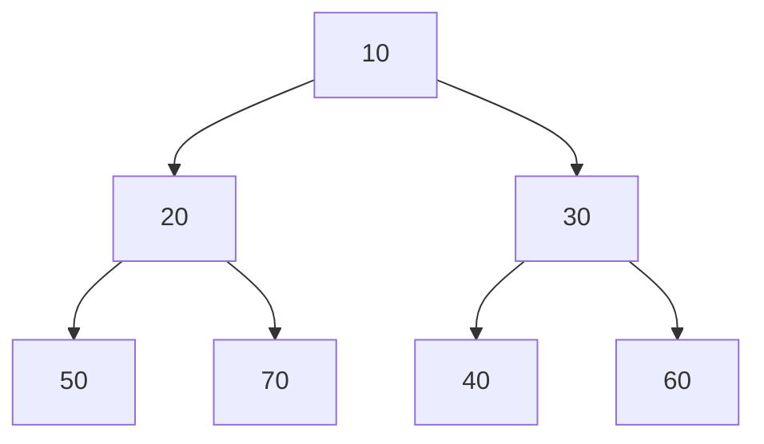
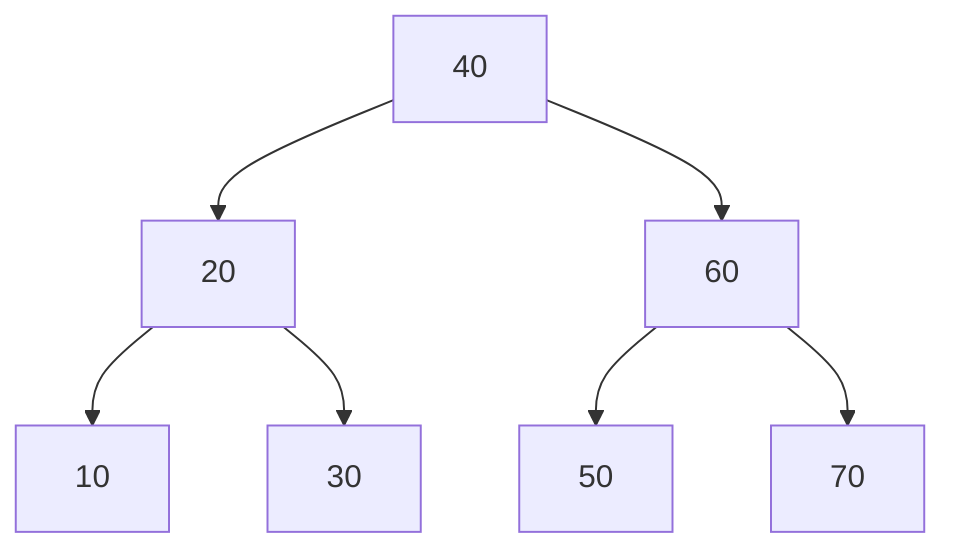
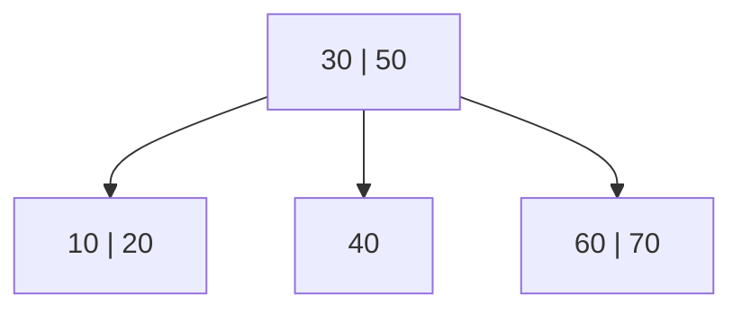
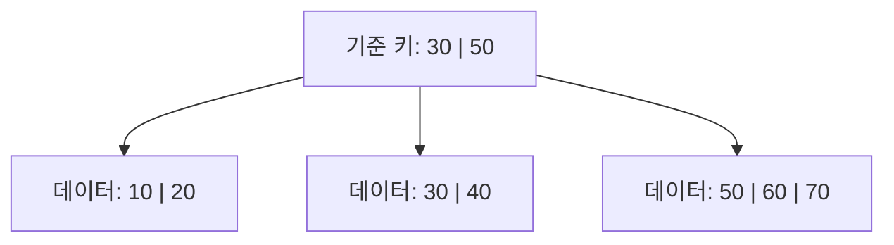

# 다섯 가지 트리 구조 비교

완전 이진 트리 · 최소 힙 · 이진 탐색 트리(BST) · B-Tree · B+Tree

> 완전 이진 트리는 **모양을 구분하는 조건**입니다. 최소 힙, BST, B-Tree, B+Tree는 값의 배치와 연산 규칙까지 갖춘 자료구조입니다. 따라서 서로 완전히 배타적인 다섯 종류는 아닙니다.

모든 그림은 동일한 일곱 개의 키 **10, 20, 30, 40, 50, 60, 70**을 사용합니다. 그림은 Mermaid 형식이며, Mermaid를 지원하는 Markdown 뷰어에서 표시됩니다.

## 1. 한눈에 비교

| 종류 | 모양 조건 | 값 배치 규칙 | 주된 목적 |
|---|---|---|---|
| 완전 이진 트리 | 자식 최대 2개. 마지막 층을 제외한 층은 꽉 차고, 마지막 층은 왼쪽부터 채움 | 없음 | 트리의 모양 구분 |
| 최소 힙 | 반드시 완전 이진 트리 | 모든 부모 값 ≤ 자식 값 | 최솟값 확인·제거 |
| 이진 탐색 트리(BST) | 자식 최대 2개. 완전하거나 균형 잡혀 있을 필요는 없음 | 왼쪽 가지 전체 < 현재 키 < 오른쪽 가지 전체 | 특정 키 검색·정렬·범위 조회 |
| B-Tree | 한 노드에 여러 키와 여러 자식. 모든 리프의 깊이가 같음 | 키를 정렬하고 키 사이의 범위에 따라 자식을 구분 | 저장장치 접근을 줄이는 균형 잡힌 검색 |
| B+Tree | B-Tree처럼 여러 키·여러 자식. 모든 리프의 깊이가 같고 리프끼리 연결 | 중간 노드는 탐색 기준, 데이터 항목은 리프에만 저장 | 정확한 키 검색·범위 조회·순차 탐색 |

**용어**

- **루트:** 맨 위에 있는 시작 노드.
- **리프(말단 노드):** 자식이 없는 노드.
- **중간 노드:** 자식이 있는 노드. 루트도 여기에 해당할 수 있음.
- **서브트리:** 어떤 노드와 그 아래에 연결된 모든 노드로 이루어진 작은 트리.
- **데이터 항목:** 실제 레코드 또는 해당 레코드의 저장 위치를 가리키는 정보.

이 문서의 BST는 중복 키가 없는 경우를 기준으로 합니다. 중복 키를 허용하려면 별도 처리 규칙이 필요합니다. 반면 최소 힙은 같은 값이 여러 번 등장해도 됩니다.

## 2. 완전 이진 트리: 모양만 확인

### 지켜야 할 조건

1. 각 노드의 자식은 최대 2개입니다.
2. 마지막 층을 제외한 모든 층이 꽉 차 있어야 합니다.
3. 마지막 층은 왼쪽부터 빈자리 없이 채워져 있어야 합니다.

위 그림은 모든 자리가 채워졌으므로 완전 이진 트리입니다. **값이 정렬되어 있는지는 상관없습니다.** 노드의 위치를 그대로 두고 숫자만 바꿔도 완전 이진 트리입니다.

완전 이진 트리라고 해서 특정 키를 빠르게 찾을 수 있는 것은 아닙니다. 값에 관한 추가 규칙이 없다면 최악의 경우 전체 N개 노드를 확인해야 합니다.

## 3. 최소 힙: 가장 작은 값을 맨 위에

### 지켜야 할 조건

1. 모양은 완전 이진 트리여야 합니다.
2. 모든 부모 값이 자식 값보다 작거나 같아야 합니다.

위 그림은 `10 ≤ 20, 30`, `20 ≤ 50, 70`, `30 ≤ 40, 60`을 만족합니다.

**왼쪽 가지 전체가 오른쪽 가지 전체보다 작을 필요는 없습니다.** 왼쪽 가지의 70이 오른쪽 가지의 40보다 커도 괜찮습니다. 형제끼리의 순서도 정해져 있지 않습니다.

- 최솟값 확인: 루트만 읽으므로 **O(1)**.
- 최솟값 제거: 제거 후 힙 규칙을 복구하므로 **O(log N)**.
- 임의의 키 검색: 어느 가지에 있는지 바로 결정할 수 없어 최악 **O(N)**.

**사용 예:** 우선순위 큐, 가장 빠른 만료 시각 관리. Mini Redis 미션의 TTL 최소 힙도 이 원리를 사용합니다.

## 4. 이진 탐색 트리(BST): 비교해서 좌우 선택

### 지켜야 할 조건

각 노드를 기준으로 **왼쪽 서브트리의 모든 키는 작고, 오른쪽 서브트리의 모든 키는 커야 합니다.** 바로 아래 자식만 비교하는 규칙이 아닙니다.

- 40의 왼쪽에 있는 10, 20, 30은 모두 40보다 작습니다.
- 40의 오른쪽에 있는 50, 60, 70은 모두 40보다 큽니다.
- 아래쪽의 20과 60에서도 같은 규칙을 지킵니다.

### 30을 찾는 과정

1. 30은 40보다 작으므로 왼쪽으로 갑니다.
2. 30은 20보다 크므로 오른쪽으로 갑니다.
3. 30을 찾습니다.

위 그림은 완전 이진 트리이기도 하지만 **BST의 필수 조건은 아닙니다.** BST는 한쪽으로 길게 치우칠 수 있습니다.

- 균형이 잘 잡혀 있을 때 검색: **O(log N)**.
- 한쪽으로 치우쳤을 때 최악의 검색: **O(N)**.
- 중위 순회(왼쪽 → 현재 노드 → 오른쪽): 키를 오름차순으로 출력.

**최소 힙과의 차이:** 최소 힙의 루트는 최솟값입니다. BST의 루트가 최솟값인 것은 아니며, 최솟값은 왼쪽 자식을 끝까지 따라가면 나옵니다.

## 5. B-Tree: 한 노드에 여러 키

> B-Tree의 B는 Binary(이진)를 뜻하지 않습니다. 자식을 2개보다 많이 둘 수 있습니다.

위 그림에서 각 숫자는 데이터 항목과 연결되어 있습니다. **루트의 30, 50도 데이터 항목을 갖고 있습니다.**

### 지켜야 할 조건

- 한 노드 안에 여러 키를 정렬해서 저장할 수 있습니다.
- 중간 노드의 키가 k개라면 자식은 k+1개입니다.
- 각 자식은 키 사이의 서로 다른 범위를 담당합니다.
- 모든 리프의 깊이가 같습니다.
- 노드별 키·자식 개수에 최소·최대 제한을 두고, 분할·병합 등의 처리로 구조를 유지합니다.

루트 `[30, 50]`의 검색 규칙은 다음과 같습니다.

| 찾는 키 | 처리 |
|---|---|
| 30 미만 | 첫 번째 자식 `[10, 20]`으로 이동 |
| 30 | 현재 노드에서 찾음 |
| 30 초과, 50 미만 | 두 번째 자식 `[40]`으로 이동 |
| 50 | 현재 노드에서 찾음 |
| 50 초과 | 세 번째 자식 `[60, 70]`으로 이동 |

**한 노드에서 여러 갈래로 나누므로 많은 데이터를 낮은 높이에 담을 수 있습니다.** 노드를 저장장치의 페이지 단위에 맞춰 구성하면 여러 키를 한 번에 읽고, 내려가는 단계도 줄일 수 있습니다.

B-Tree도 정렬된 순회와 범위 조회가 가능합니다. 범위 조회가 불가능해서 B+Tree를 쓰는 것은 아닙니다.

## 6. B+Tree: 데이터는 리프에, 리프끼리 연결

세 리프는 모두 같은 깊이에 있습니다. 위 그림에서 생략한 **리프 간 연결**은 다음과 같습니다.

| 현재 리프 | 다음 리프 |
|---|---|
| `[10, 20]` | `[30, 40]` |
| `[30, 40]` | `[50, 60, 70]` |
| `[50, 60, 70]` | 없음 |

### B-Tree와 다른 점

- 중간 노드는 아래로 내려갈 방향을 정하는 **기준 키와 자식 포인터**를 저장합니다.
- 실제 데이터 항목은 **리프에만** 있습니다.
- 리프끼리 키 순서대로 연결되어 있습니다.
- 모든 리프의 깊이가 같습니다.

위 예시에서는 중간 노드의 30과 50을 오른쪽 자식 범위의 시작 키로 사용합니다. 따라서 30은 가운데 자식으로, 50은 오른쪽 자식으로 내려갑니다. 분리 키의 구체적인 표현 방식은 구현에 따라 다를 수 있습니다.

**위쪽의 30·50은 안내용 기준 키가 반복된 것입니다.** 데이터 항목 자체를 두 군데에 중복 저장한 것이 아닙니다. 중간 노드에서 같은 키를 만나도 데이터 항목을 얻으려면 리프까지 내려갑니다.

### 20부터 50까지 조회하는 과정

1. 트리를 내려가 20이 들어 있는 `[10, 20]` 리프를 찾습니다.
2. 20을 읽고 다음 리프 `[30, 40]`으로 이동합니다.
3. 30과 40을 읽고 다음 리프 `[50, 60, 70]`으로 이동합니다.
4. 50을 읽고 종료합니다.

처음 위치를 찾은 뒤에는 **연결된 리프를 따라 연속된 데이터를 읽을 수 있습니다.** 이 특성 때문에 DB 인덱스의 정확한 키 검색과 범위 조회에 잘 맞습니다.

## 7. B-Tree와 B+Tree 비교

| 구분 | B-Tree | B+Tree |
|---|---|---|
| 데이터 항목 위치 | 중간 노드와 리프 | 리프에만 |
| 중간 노드 역할 | 검색 기준 + 데이터 항목 보관 | 검색 기준 + 자식 안내 |
| 검색 종료 위치 | 중간 노드에서 끝날 수 있음 | 리프까지 내려감 |
| 범위 조회 | 트리 노드들을 정렬 순서로 순회 | 시작 리프를 찾고 연결된 리프를 따라 이동 |
| 리프 깊이 | 모두 같음 | 모두 같음 |

한 노드에 허용하는 키 수와 자식 수는 구현의 용량 설정에 따라 달라집니다. 위 그림은 구조 차이를 보여 주는 작은 예시입니다.

## 8. 시간복잡도 비교

N은 전체 키 개수입니다. 아래 표는 키 비교 비용을 일정하게 보는 일반적인 시간복잡도입니다.

| 구조 | 임의의 키 하나 검색 | 기억할 점 |
|---|---|---|
| 완전 이진 트리 | 정렬 규칙이 없다면 최악 O(N) | 모양만으로 빠른 검색을 보장하지 않음 |
| 최소 힙 | 최악 O(N) | 최솟값 확인 O(1), 최솟값 제거 O(log N) |
| 일반 BST | 균형이 좋으면 O(log N), 최악 O(N) | 모양이 한쪽으로 치우칠 수 있음 |
| B-Tree | O(log N) | 여러 자식과 균형 유지로 높이를 낮춤 |
| B+Tree | O(log N) | 리프 연결로 범위 조회·순차 탐색에 유리 |

O(log N)이 같아도 실제 처리 시간이 같다는 뜻은 아닙니다. 노드 크기, 키 비교 방식, 캐시, 저장장치 접근 횟수 등이 영향을 줍니다. 범위 조회는 시작 위치를 찾은 뒤 결과를 읽는 비용도 추가됩니다.

## 9. 헷갈리지 않게 기억하기

- **완전 이진 트리:** 빈자리 없이 왼쪽부터 채웠는가?
- **최소 힙:** 부모가 자식보다 작거나 같은가?
- **BST:** 원하는 키가 왼쪽과 오른쪽 중 어디에 있는가?
- **B-Tree:** 한 노드의 여러 키로 탐색 범위를 나누는가?
- **B+Tree:** 데이터는 리프에 모으고 리프끼리 연결했는가?

**무조건 가장 좋은 트리는 없습니다.** 최솟값을 자주 꺼내면 힙, 정렬된 키를 탐색하면 검색 트리, 저장장치에서 많은 데이터를 검색·범위 조회하면 B-Tree 계열이 적합합니다.
